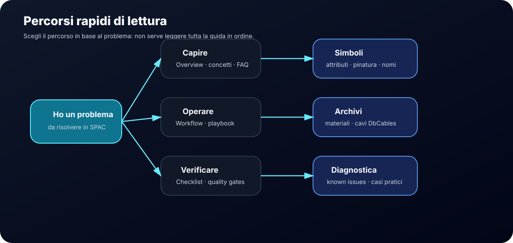

# Come usare questa guida

Questa pagina serve come punto di orientamento. La knowledge base non va letta tutta in ordine: va usata in base al problema da risolvere.

## Percorsi consigliati

| Se devi... | Parti da | Poi vai a |
|---|---|---|
| capire come è organizzata la guida | [Overview](00-overview.md) | [Concetti SPAC](concepts.md) |
| preparare ambiente o progetto | [Libreria custom](15-custom-library.md) | [Template progetto](16-project-template.md) |
| lavorare su uno schema | [Schema unifilare](17-unifilare.md) | [Rimandi e morsetti](06-cross-references-terminals.md) |
| creare o sistemare un simbolo custom | [Simboli custom](03-custom-symbols.md) | [Attributi e pinatura](04-attributes-and-pinning.md) |
| verificare un simbolo prima del riuso | [Checklist validazione simbolo](10-symbol-validation-checklist.md) | [Quality gates](14-quality-gates.md) |
| gestire materiali o cavi | [Archivi materiali custom](21-material-archives.md) | [Archivio Cavi DbCables](25-cable-archive-dbcables.md) |
| scaricare archivi pubblicati | [Download](downloads.md) | [Back-check e controlli incrociati](26-back-check-controls.md) |
| seguire una procedura passo-passo | [Playbook](playbooks/index.md) | [Command Reference](command-reference.md) |
| risolvere un problema pratico | [Troubleshooting](07-troubleshooting.md) | [Known Issues](known-issues/index.md) |
| capire una scelta già presa | [Decision log](11-decision-log.md) | [Standard operativi](08-standards.md) |

## Regola pratica

Ogni pagina dovrebbe aiutare a fare almeno una di queste cose:

- decidere;
- configurare;
- verificare;
- diagnosticare;
- standardizzare.

Se una pagina non aiuta in nessuno di questi punti, va semplificata.

## Differenza tra sezioni

| Sezione | Scopo |
|---|---|
| Start | Orientamento, guida completa, concetti e glossario |
| Operativo | Setup, schemi, simboli, archivi e download |
| Playbook | Procedure guidate, checklist e riferimenti rapidi |
| Diagnosi | Problemi noti, troubleshooting e casi pratici |
| Governance | Standard, decisioni, manutenzione, quality gates e roadmap |

## Metodo di aggiornamento

Quando si aggiunge una nuova informazione:

1. inserirla nella sezione corretta;
2. collegarla a una procedura o a uno standard;
3. evitare duplicazioni;
4. aggiungere uno schema solo se chiarisce davvero il funzionamento;
5. verificare che la pagina sia raggiungibile dalla navigazione o dalla Home.
