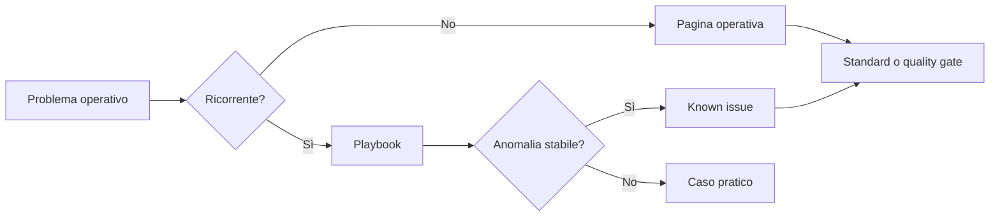

# Overview

Questa knowledge base raccoglie procedure e standard operativi per l'utilizzo di **SPAC Start Impianti** in contesti di progettazione elettrica e workflow CAD collegati.

Il focus è pratico: documentare ciò che serve davvero durante il lavoro quotidiano, evitando una struttura troppo pesante o dispersiva.

!!! note "Scopo della knowledge base"

    Questa non è una copia del manuale SPAC. È una base operativa per decidere,
    eseguire, diagnosticare e verificare workflow ricorrenti in SPAC Start.

## Obiettivi operativi

- Ridurre la dipendenza dalla memoria individuale.
- Evitare procedure duplicate o contraddittorie.
- Standardizzare simboli custom, attributi e pinatura.
- Rendere più veloce il troubleshooting.
- Separare contenuti generici da materiali specifici di commessa.
- Creare una guida incrementale, facile da aggiornare.

## Cosa contiene

La repository contiene:

- guide operative;
- standard di naming;
- checklist;
- troubleshooting;
- template;
- note tecniche su casi ricorrenti.

## Cosa non contiene

La repository non deve contenere:

- dati cliente;
- schemi elettrici completi di commessa;
- archivi materiali proprietari;
- credenziali o path sensibili;
- file DWG aziendali non pubblicabili;
- screenshot con dati riservati.

!!! warning "Prima di pubblicare"

    Se una nota, immagine o archivio contiene dati cliente, commessa, ordine o
    informazioni non pubblicabili, non deve entrare nella knowledge base.

## Metodo di aggiornamento

Ogni nuova nota dovrebbe rispettare questa logica:

1. descrivere il problema o il workflow;
2. indicare la procedura consigliata;
3. separare ciò che è testato da ciò che è ancora da verificare;
4. aggiornare eventuali checklist collegate;
5. mantenere il linguaggio operativo e diretto.

## Modello documentale

Le pagine non hanno tutte lo stesso ruolo. Prima di aggiungere contenuto,
scegliere il tipo di pagina più adatto.

| Tipo pagina | Quando usarla | Deve collegare |
|---|---|---|
| Pagina operativa | Descrive un'area stabile del lavoro SPAC Start | playbook, quality gate, standard |
| Playbook | Guida un caso pratico passo-passo | pagina operativa, troubleshooting o known issue |
| Known issue | Documenta un problema ricorrente e diagnosticabile | playbook di risoluzione e prevenzione |
| Standard | Fissa una regola riutilizzabile | verifica e impatto operativo |
| Quality gate | Dice quando una modifica è pronta | comandi di validazione e checklist |
| Decision log | Registra una scelta già presa | motivazione, impatto e stato |

## Convenzione documentale

Usare preferibilmente file Markdown brevi, con sezioni chiare e titoli descrittivi.

Le procedure devono essere scritte come istruzioni operative, non come appunti disordinati.

## Baseline documentale

La base documentale è considerata completa come struttura iniziale quando sono presenti:

- Home e guida d'uso;
- navigazione MkDocs coerente;
- overview, concetti, FAQ e glossario;
- workflow operativi principali;
- playbook, troubleshooting, standard, decision log e quality gates;
- changelog per tracciare le evoluzioni.

Nuove pagine e casi pratici possono essere aggiunti in futuro, ma non bloccano più la completezza della baseline.
