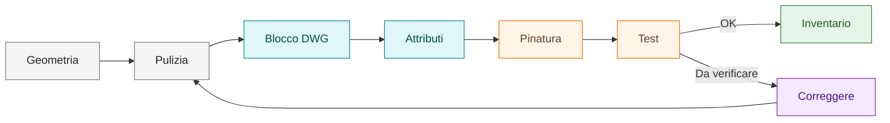

# Simboli custom

Questa sezione definisce il workflow operativo per creare e gestire simboli custom in SPAC Start.

Il ciclo di vita di un simbolo custom parte dalla geometria e arriva al riuso
solo dopo test e inventario.



## In questa pagina impari

- distinguere simbolo grafico, blocco DWG e simbolo SPAC intelligente;
- capire quando servono attributi, `PRES` e pinatura;
- collegare creazione, validazione, inventario e riuso;
- scegliere il playbook corretto per creare o diagnosticare un simbolo.

## Concetto generale

In SPAC è importante distinguere tra:

- **grafica CAD**: semplice disegno, non intelligente;
- **blocco CAD**: insieme di entità raggruppate;
- **simbolo SPAC intelligente**: oggetto riconosciuto da SPAC, con attributi e logiche applicative.

Un simbolo custom utile deve essere riconoscibile e gestibile come componente SPAC, non solo come geometria grafica.

!!! tip "Regola pratica"

    Un simbolo è pronto al riuso solo quando inserimento, attributi, pinatura,
    materiale e report sono stati verificati in un progetto di prova.

## Workflow generale

| Fase | Output |
|---|---|
| Disegno sorgente | Geometria o simbolo base |
| Pulizia | Entità essenziali e leggibili |
| Normalizzazione | Layer, colore, tipo linea e scala coerenti |
| Blocco DWG | Simbolo salvato nella categoria corretta |
| Anteprima SLD | Anteprima con stesso nome base del DWG |
| Attributi | Madre, Figlio, pinatura e dati componente |
| Test | Inserimento, collegamenti, materiale e report |
| Inventario | Stato e note operative documentate |

## Quando usare le pagine collegate

| Necessità | Pagina o playbook |
|---|---|
| capire il ruolo di grafica, blocco e simbolo intelligente | [Concetti SPAC](concepts.md) |
| creare un simbolo con procedura guidata | [Creare un simbolo custom](playbooks/create-custom-symbol.md) |
| impostare attributi, pinatura e relazione PINA/PINB | [Attributi e pinatura](04-attributes-and-pinning.md) |
| applicare una convenzione di nome stabile | [Nomenclatura simboli](19-symbol-naming.md) |
| validare aggancio, attributi e riuso | [Checklist validazione simbolo](10-symbol-validation-checklist.md) |
| diagnosticare pin che non agganciano | [Diagnosticare pin non agganciato](playbooks/diagnose-pin-not-snapping.md) |
| associare un materiale al simbolo | [Associare materiali](playbooks/material-association.md) |
| decidere se il simbolo è pronto per standard o download | [Quality gates](14-quality-gates.md) |

## Creazione elemento grafico

Questa procedura serve quando si parte da:

- DWG esterno;
- simbolo SPAC esistente;
- geometria disegnata manualmente.

Regole iniziali:

- lavorare in un foglio o progetto di prova;
- non usare una commessa reale come laboratorio;
- pulire il disegno da testi o linee non necessarie;
- normalizzare layer, colore, tipo linea e spessore.

## Importazione da DWG esterno

Dopo aver importato un DWG esterno:

1. verificare scala;
2. verificare layer;
3. eliminare attributi o testi non necessari;
4. esplodere solo se serve realmente;
5. normalizzare il disegno;
6. trasformarlo in blocco riutilizzabile.

## Importazione da simbolo SPAC esistente

Un simbolo esistente può essere usato come base, ma va sempre ripulito.

Checklist:

- rimuovere attributi non pertinenti;
- verificare logica Madre/Figlio;
- controllare pinatura;
- rinominare secondo convenzione;
- testare il nuovo simbolo come entità autonoma.

## Pulizia e normalizzazione

Per i simboli custom:

- usare Layer 0;
- colore DaBlocco;
- tipo linea DaBlocco;
- spessore linea DaBlocco;
- eliminare elementi non necessari;
- mantenere il disegno leggibile e scalato.

## Creazione blocco DWG

Quando la geometria è pronta:

1. selezionare gli oggetti del simbolo;
2. creare il blocco DWG;
3. scegliere un punto base coerente;
4. salvare nella categoria corretta della libreria custom;
5. usare il nome secondo la convenzione;
6. lasciare l'unità senza forzature se il simbolo deve restare generico.

Per simboli puramente grafici, il punto base può essere il centro grafico. Per simboli con pin, il punto base deve aiutare l'inserimento coerente nello schema.

## Creazione anteprima SLD

Ogni blocco DWG custom deve avere un'anteprima coerente.

Regole:

- aprire il DWG del simbolo;
- centrare il disegno;
- regolare lo zoom;
- creare la slide SLD;
- salvare la slide nella stessa cartella del DWG;
- usare lo stesso nome base.

Regola obbligatoria:

```text
NOME_SIMBOLO.dwg
NOME_SIMBOLO.sld
```

## Simbolo Madre

Un simbolo Madre rappresenta il componente principale.

Convenzione operativa:

```text
PRES = M
```

Esempi di simboli che possono essere gestiti come Madre:

- selettori;
- attuatori a chiave;
- dispositivi modulari;
- componenti senza pin ma con materiale associabile.

## Simbolo Figlio

Un simbolo Figlio rappresenta un elemento collegato a un componente Madre, ad esempio:

- contatti ausiliari;
- bobine;
- accessori;
- elementi funzionali associati.

La relazione Madre/Figlio deve essere chiara e verificabile nel progetto.

Regola operativa:

- Madre con `PRES = M`;
- Figlio con `PRES = F`;
- Figlio con lo stesso `NOME` della Madre quando deve essere associato logicamente.

## Simboli senza pin

Un simbolo può essere utile anche senza pin se rappresenta un componente riconosciuto e associabile a materiali.

Esempio: attuatore a chiave rappresentato come simbolo Madre senza pin.

Prefisso consigliato per attuatori/selettori:

```text
SA
```

## Simboli cablati

Per simboli cablati, la pinatura deve essere gestita con attributi coerenti.

Gli attributi di pin principali sono documentati in:

```text
04-attributes-and-pinning.md
```

## Simboli complessi

Per simboli complessi, evitare un unico oggetto ingestibile.

Workflow consigliato:

- creare simboli semplici e coerenti;
- usare macro per raggruppare insiemi ricorrenti;
- mantenere chiara la relazione tra elementi;
- testare ogni simbolo singolarmente prima di inserirlo in macro.

## Associazione materiale

Un simbolo intelligente può avere materiali associati se deve contribuire alla distinta.

Regole:

- associare materiali solo a simboli riconosciuti;
- evitare materiali su pura grafica;
- verificare report o distinta;
- documentare eccezioni.

## Inventario simboli

L'inventario completo dei simboli custom non deve stare nel README.

Convenzione consigliata:

```text
SPAC_Custom_Simboli_Convenzione.xlsx
```

Il file Excel può contenere:

- nome simbolo;
- descrizione;
- categoria;
- attributi principali;
- presenza pin;
- materiale associabile;
- stato di validazione;
- note operative.

## Checklist simbolo custom

Prima di considerare un simbolo custom riutilizzabile:

- verificare attributi principali;
- verificare eventuale PRES;
- verificare pinatura se presente;
- testare modifica attributi con editor attributi;
- testare inserimento in progetto prova;
- testare associazione materiale se richiesta;
- documentare nome e convenzione nell'inventario.

## Baseline sezione

La sezione simboli custom è completa come riferimento operativo quando permette di:

- distinguere grafica CAD, blocco DWG e simbolo intelligente;
- creare DWG e SLD con lo stesso nome base;
- gestire simboli Madre e Figlio;
- distinguere simboli senza pin, cablati e complessi;
- associare materiali solo quando il simbolo deve contribuire alla distinta;
- rimandare a inventario, checklist e standard di nomenclatura.

I nuovi simboli reali vanno aggiunti all'inventario dedicato, non alla struttura della guida.
