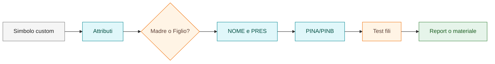

# Attributi e pinatura

Questa sezione raccoglie le convenzioni operative sugli attributi principali dei simboli custom SPAC e sulla gestione della pinatura.

## In questa pagina impari

- quali attributi controllare nei simboli custom;
- come distinguere Madre, Figlio e relazione logica;
- quando usare solo `PINA<n>` e quando aggiungere `PINB<n>`;
- quali test fare prima di validare il simbolo.

## Flusso attributi e pin



## Attributi principali

Attributi ricorrenti da considerare nei simboli custom:

| Attributo | Uso operativo |
|---|---|
| `NOME` | Identificativo del componente |
| `PRES` | Presenza/tipo simbolo, ad esempio Madre o Figlio |
| `DESCRIZIONE` | Descrizione funzionale |
| `TIPO` | Tipo componente |
| `COSTRUTTORE` | Costruttore o marca |
| `QUADRO` | Quadro o area di appartenenza |

## Simbolo Madre

Per indicare un simbolo Madre:

```text
PRES = M
```

La Madre identifica il componente principale nello schema.

## Simbolo Figlio

Un simbolo Figlio è collegato a una Madre e rappresenta un elemento associato.

Regola operativa:

- il Figlio deve avere `PRES = F`;
- il Figlio deve richiamare lo stesso `NOME` della Madre;
- la relazione non deve essere basata solo sulla vicinanza grafica.

Esempi di Figli:

- contatti ausiliari;
- bobine;
- accessori;
- riferimenti funzionali collegati a una Madre.

## Attributo NOME

`NOME` deve identificare il componente o richiamare la Madre quando il simbolo è Figlio.

Per un simbolo Madre, `NOME` è la sigla principale.

Per un simbolo Figlio, `NOME` deve essere coerente con la Madre associata.

## Attributo PRES

`PRES` definisce il ruolo del simbolo.

Valori operativi:

| Valore | Uso |
|---|---|
| `M` | Simbolo Madre |
| `F` | Simbolo Figlio o elemento associato |

## Pinatura standard

Per i simboli SPAC custom, lo standard adottato è:

```text
PINA1
PINA2
PINA3
...
```

La presenza di `PINB`, con lo stesso numero incrementale, indica che il segnale presente su `PINA<n>` viene riportato in uscita su `PINB<n>`.

Esempio:

| Ingresso | Uscita collegata | Significato |
|---|---|---|
| `PINA1` | `PINB1` | Il segnale entra su PINA1 e viene riportato su PINB1 |
| `PINA2` | `PINB2` | Il segnale entra su PINA2 e viene riportato su PINB2 |

## Quando usare solo PINA

Usare solo `PINA<n>` quando il simbolo rappresenta un punto di connessione singolo o non deve riportare il segnale in uscita.

## Quando usare PINA e PINB

Usare `PINA<n>` + `PINB<n>` quando il simbolo è attraversato da un collegamento o quando il segnale deve essere rappresentato in ingresso e uscita.

## Configurazione grafica dei pin

Linee guida:

- testo pin standard nei BLK custom: 1.5;
- posizione coerente con la griglia;
- attributi bloccati in posizione quando necessario;
- orientamento coerente con il significato elettrico.

## Posizione dei pin

La posizione dei pin deve essere coerente con la griglia di disegno.

Linee guida:

- allineare i pin alla griglia;
- evitare posizioni arbitrarie;
- verificare aggancio fili dopo l'inserimento;
- testare il simbolo in un progetto prova;
- mantenere coerenza tra orientamento grafico e significato del pin.

## Test consigliati

Dopo aver creato o modificato un simbolo:

1. inserirlo in un progetto di prova;
2. verificare modifica attributi;
3. collegare fili ai pin;
4. controllare aggancio e continuità grafica;
5. verificare eventuali report o associazioni materiali;
6. aggiornare l'inventario simboli custom.

## Nota su PINB

Non usare `PINB` se non serve realmente riportare il segnale. Una pinatura eccessiva o non coerente rende il simbolo più difficile da mantenere.

!!! warning "Errore da evitare"

    Non aggiungere pin per tentativi. Se il filo non aggancia, verificare prima
    posizione, attributo del pin, griglia e stato del simbolo.

## Baseline sezione

La sezione attributi e pinatura è completa come riferimento operativo quando documenta:

- ruolo degli attributi principali;
- differenza tra simbolo Madre e simbolo Figlio;
- uso di `NOME` e `PRES`;
- convenzione `PINA<n>` / `PINB<n>`;
- casi in cui usare solo `PINA`;
- casi in cui usare `PINA` e `PINB`;
- controlli finali su aggancio fili, attributi e report.

Le eccezioni devono essere documentate nel simbolo specifico o nel decision log.
