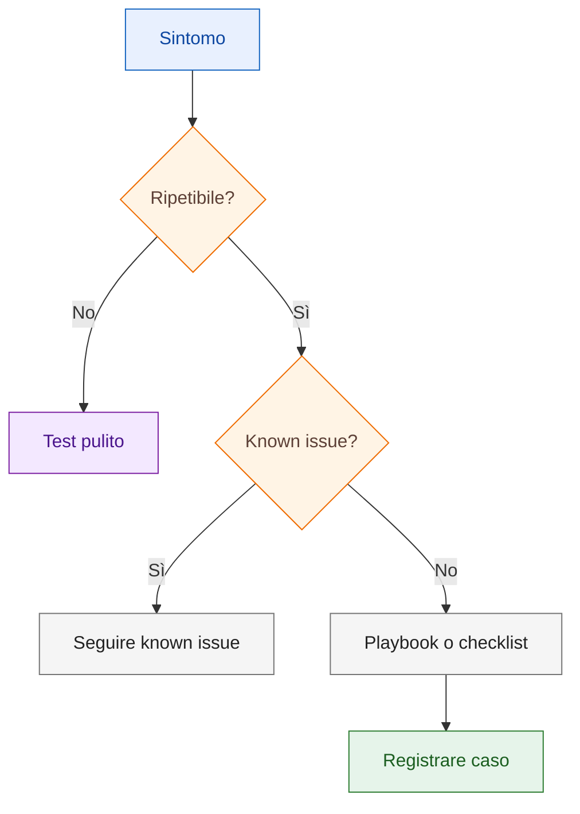

# Troubleshooting

Questa sezione raccoglie problemi ricorrenti e checklist diagnostiche per SPAC Start.

!!! tip "Metodo rapido"

    Prima identifica il livello del problema: grafica CAD, attributi, oggetto
    intelligente, rappresentazione, riferimento esterno o archivio.

## Diagnosi rapida

| Sintomo | Prima verifica | Pagina o playbook |
|---|---|---|
| un simbolo non si collega correttamente | pinatura, attributi e oggetti residui | [Diagnosticare pin non agganciato](playbooks/diagnose-pin-not-snapping.md) |
| un morsetto mostra un dato diverso da quello atteso | dato sorgente e rappresentazione grafica | [Verificare rappresentazione morsetti](playbooks/terminal-representation.md) |
| un rimando non accetta la selezione | linea CAD o collegamento SPAC riconosciuto | [Diagnosticare rimandi alimentazione](playbooks/power-reference-diagnostic.md) |
| un cross-reference punta a una posizione vecchia | oggetti residui e riferimenti non rigenerati | [Known Issue - Cross-reference obsoleto](known-issues/obsolete-cross-reference.md) |
| un materiale manca o risulta duplicato | punto di associazione e report | [Associare materiali](playbooks/material-association.md) |
| `DbCables.db` non risulta allineato | allineamento versione librerie e riapertura SPAC | [Known Issue DbCables](known-issues/dbcables-version-mismatch.md) |
| un file scaricabile non è affidabile | sanitizzazione, versione, hash e link | [Download](downloads.md) e [Quality gates](14-quality-gates.md) |

## Menu o librerie non visibili

Sintomi:

- menu mancanti;
- libreria simboli non accessibile;
- comandi SPAC non disponibili;
- ambiente CAD alterato.

Checklist:

- verificare profilo/ambiente caricato;
- ripristinare menu;
- riaprire il progetto;
- verificare che i comandi SPAC siano disponibili;
- annotare eventuali personalizzazioni dell'interfaccia.

## Simbolo custom non riconosciuto

Possibili cause:

- attributi mancanti;
- `PRES` non coerente;
- simbolo rimasto come semplice blocco CAD;
- pin non correttamente definiti;
- simbolo non testato in progetto prova.

Checklist:

- verificare attributi;
- verificare nome e categoria;
- verificare presenza di pin se richiesti;
- testare inserimento;
- testare associazione materiale;
- aggiornare inventario simboli.

## Pin non si aggancia al filo

Possibili cause:

- pin fuori griglia;
- attributo pin non corretto;
- posizione grafica non coerente;
- simbolo esploso o alterato;
- filo non creato come collegamento intelligente.

Checklist:

- verificare posizione pin;
- allineare alla griglia;
- controllare nome attributo pin;
- testare con un filo nuovo;
- verificare in progetto prova.

## Logo o immagine non visibile

Possibili cause:

- riferimento esterno non risolto;
- file immagine spostato;
- percorso non più valido;
- visualizzazione frame attiva ma immagine non caricata.

Checklist:

- verificare file immagine;
- verificare percorso;
- ricaricare riferimento;
- chiudere e riaprire;
- testare su copia del progetto.

## Cross-reference errato

Possibili cause:

- vecchi oggetti intelligenti;
- riferimenti non rigenerati;
- rimandi duplicati;
- oggetti cancellati solo graficamente.

Checklist:

- cercare oggetti residui;
- verificare rimandi non utilizzati;
- rigenerare riferimenti;
- testare su un foglio pulito;
- evitare correzioni solo grafiche.

## Disegno importato fuori scala

Checklist:

- misurare una quota nota;
- calcolare fattore di scala;
- scalare il disegno;
- verificare una seconda quota;
- controllare unità e snap.

## Regola generale

Quando qualcosa non funziona, distinguere sempre tra:

- problema grafico;
- problema di attributi;
- problema di oggetto intelligente;
- problema di configurazione;
- problema di riferimento esterno.

Correggere la causa, non solo l'effetto visibile.
