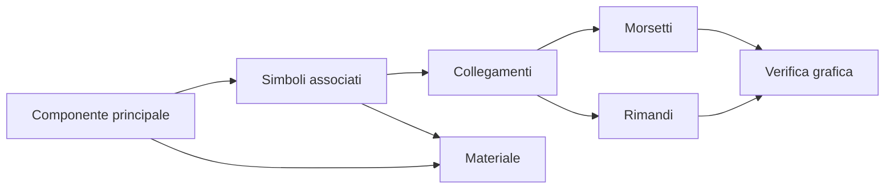

# Multifilare

Questa sezione raccoglie le procedure relative al lavoro in ambiente multifilare SPAC Start.

Stato: in sviluppo operativo.

## Obiettivo

Nel multifilare il disegno non deve essere trattato come sola grafica. Ogni elemento può avere significato elettrico, attributi, relazioni, riferimenti e rappresentazioni.

L'obiettivo è mantenere chiara la relazione tra:

- componente principale;
- elementi associati;
- materiale;
- collegamenti;
- morsetti;
- rimandi;
- rappresentazione grafica.

## Mappa del workflow

## Componenti principali

Un componente principale deve essere identificabile in modo chiaro.

Esempi concettuali:

- interruttore;
- selettore;
- relè;
- dispositivo modulare;
- componente con accessori.

Quando il componente ha elementi associati, la relazione deve essere gestita in modo esplicito e verificabile.

## Elementi associati

Gli elementi associati possono includere:

- contatti ausiliari;
- bobine;
- accessori;
- elementi funzionali collegati.

Regola operativa: non affidarsi solo alla vicinanza grafica. La relazione deve essere coerente anche dal punto di vista dati/simbolo.

## Materiali

L'associazione materiale deve essere effettuata sul simbolo più coerente con la logica del componente.

Prima di associare materiale verificare:

- simbolo riconosciuto;
- attributi coerenti;
- relazione Madre/Figlia, se presente;
- rappresentazione corretta in distinta o report.

## Morsetti

Per i morsetti distinguere sempre:

- morsettiera;
- numero morsetto;
- numero filo;
- riferimento funzionale;
- rappresentazione grafica.

Se il testo visibile non è quello atteso, non correggere solo la grafica: controllare dato sorgente e rappresentazione.

## Rimandi

Un rimando deve essere collegato a un oggetto coerente, non a una semplice linea grafica.

Quando un rimando non funziona:

1. verificare se l'oggetto è riconosciuto;
2. controllare eventuali residui;
3. rigenerare o aggiornare i riferimenti;
4. testare su foglio pulito.

## Checklist multifilare

Prima di considerare stabile una parte multifilare:

- componente principale identificato;
- elementi associati verificati;
- collegamenti riconosciuti;
- morsetti rappresentati correttamente;
- rimandi coerenti;
- materiale associato dove necessario;
- nessuna correzione solo grafica non documentata.

## Collegamenti utili

- [Rimandi, cross-reference e morsetti](06-cross-references-terminals.md)
- [Simboli custom](03-custom-symbols.md)
- [Attributi e pinatura](04-attributes-and-pinning.md)
- [Troubleshooting](07-troubleshooting.md)
