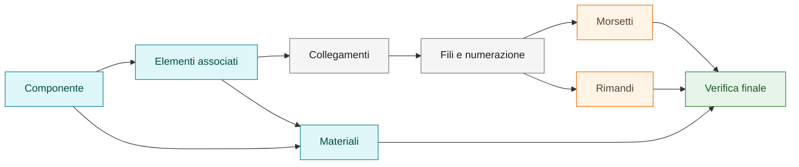

# Multifilare

Questa pagina orienta il lavoro in ambiente multifilare SPAC Start e rimanda
alle procedure specialistiche già presenti nella knowledge base.

Stato: base operativa presente, da consolidare con casi reali riutilizzabili.

## In questa pagina impari

- come leggere il multifilare come insieme di oggetti, dati e rappresentazioni;
- quando passare ai playbook su accessori, morsetti, rimandi o materiali;
- quali controlli fare prima di validare report, distinta o cross-reference;
- quando marcare un comportamento come `Da verificare`.

## Obiettivo

Nel multifilare il disegno non deve essere trattato come sola grafica. Ogni
elemento può avere significato elettrico, attributi, relazioni, riferimenti e
rappresentazioni.

L'obiettivo è mantenere chiara la relazione tra:

- componente principale;
- elementi associati;
- collegamenti;
- fili e numerazioni;
- morsetti;
- rimandi;
- materiale;
- rappresentazione grafica.

## Quando usarla

Usare questa pagina quando serve impostare o verificare una parte multifilare
prima di entrare nei dettagli operativi.

Per procedure specifiche usare i playbook collegati:

| Necessità | Riferimento |
|---|---|
| Accessori, contatti o bobine associati a un componente | [Gestire accessori e bobine](playbooks/manage-accessories-and-coils.md) |
| Morsetto che mostra un dato non atteso | [Verificare rappresentazione morsetti](playbooks/terminal-representation.md) |
| Rimando non accettato o riferimento non coerente | [Diagnosticare rimandi alimentazione](playbooks/power-reference-diagnostic.md) |
| Materiale da associare a componente o accessorio | [Associare materiali](playbooks/material-association.md) |
| Cross-reference verso posizione non valida | [Known Issue - Cross-reference obsoleto](known-issues/obsolete-cross-reference.md) |

## Quando non usarla

Non usare questa pagina come guida completa per correggere un singolo sintomo.
Se il problema è già chiaro, aprire direttamente il playbook o la known issue
correlata.

## Principio operativo

Non correggere solo l'effetto visibile. Prima distinguere sempre tra:

- grafica CAD;
- simbolo SPAC intelligente;
- attributi del simbolo;
- relazione Madre/Figlia;
- collegamento riconosciuto;
- dato sorgente mostrato dalla rappresentazione;
- report, distinta o cross-reference generati.

!!! warning "Da verificare"

    Se un comportamento non è verificato in SPAC Start 26, documentarlo come
    `Da verificare`.

!!! warning "Prima della correzione"

    Nel multifilare una correzione solo grafica può nascondere il problema
    reale. Verificare sempre oggetto SPAC, attributi, collegamenti, dato
    sorgente e rappresentazione.

## Sequenza consigliata

1. Identificare il componente principale.
2. Verificare eventuali elementi associati.
3. Controllare che i collegamenti siano riconosciuti come oggetti SPAC.
4. Verificare fili, identificazioni e numerazioni necessarie.
5. Inserire o controllare morsetti e morsettiere.
6. Verificare rimandi e cross-reference.
7. Associare materiali solo al livello coerente.
8. Eseguire una verifica finale su rappresentazione, dati e report.

## Componenti principali

Un componente principale deve essere identificabile in modo chiaro.

Esempi concettuali:

- interruttore;
- selettore;
- relè;
- dispositivo modulare;
- componente con accessori.

Quando il componente ha elementi associati, la relazione deve essere esplicita
e verificabile. Non basta la vicinanza grafica.

Verificare:

- simbolo riconosciuto;
- attributi coerenti;
- eventuale ruolo Madre/Figlia;
- nome o identificativo coerente;
- effetto su report o distinta.

## Elementi associati

Gli elementi associati possono includere:

- contatti ausiliari;
- bobine;
- accessori;
- elementi funzionali collegati.

Regola operativa: la relazione deve essere coerente dal punto di vista
dati/simbolo, non solo grafico.

Per il flusso di lavoro usare il playbook
[Gestire accessori e bobine](playbooks/manage-accessories-and-coils.md).

## Collegamenti e fili

Prima di validare morsetti o rimandi, verificare che il collegamento sia
riconosciuto correttamente.

Controllare:

- differenza tra linea CAD e collegamento intelligente;
- identificazione dei fili;
- numerazione richiesta;
- assenza di oggetti sovrapposti o residui;
- coerenza con [Numerazione e identificazione fili](18-wire-numbering.md).

## Morsetti

Per i morsetti distinguere sempre:

- morsettiera;
- numero morsetto;
- numero filo;
- riferimento funzionale;
- rappresentazione grafica selezionata.

Se il testo visibile non è quello atteso, non correggere solo la grafica:
controllare dato sorgente e rappresentazione.

La distinzione operativa è:

- oggetto morsetto;
- dati sorgente;
- rappresentazione grafica;
- testo visibile.

Riferimenti operativi:

- [Rimandi, cross-reference e morsetti](06-cross-references-terminals.md)
- [Verificare rappresentazione morsetti](playbooks/terminal-representation.md)

## Rimandi e cross-reference

Un rimando deve essere collegato a un oggetto coerente, non a una semplice linea
grafica.

Prima di diagnosticare un rimando distinguere tra:

- linea grafica CAD;
- alimentazione o collegamento SPAC;
- oggetto intelligente;
- rimando;
- cross-reference generato.

Quando un rimando non funziona:

1. verificare se l'oggetto è riconosciuto;
2. controllare eventuali residui;
3. aggiornare o rigenerare i riferimenti;
4. testare su foglio pulito.

Riferimenti operativi:

- [Rimandi, cross-reference e morsetti](06-cross-references-terminals.md)
- [Diagnosticare rimandi alimentazione](playbooks/power-reference-diagnostic.md)
- [Known Issue - Cross-reference obsoleto](known-issues/obsolete-cross-reference.md)

## Materiali

L'associazione materiale deve essere effettuata sul simbolo più coerente con la
logica del componente.

Prima di associare materiale verificare:

- simbolo riconosciuto;
- attributi coerenti;
- relazione Madre/Figlia, se presente;
- rappresentazione corretta in distinta o report;
- assenza di duplicazioni indesiderate.

Per il flusso di lavoro usare il playbook
[Associare materiali](playbooks/material-association.md).

## Diagnostica rapida

| Sintomo | Prima verifica | Riferimento |
|---|---|---|
| Accessorio non collegato logicamente al componente | Attributi e relazione Madre/Figlia | [Gestire accessori e bobine](playbooks/manage-accessories-and-coils.md) |
| Morsetto mostra numero filo invece del dato atteso | Campo visualizzato dalla rappresentazione | [Verificare rappresentazione morsetti](playbooks/terminal-representation.md) |
| Rimando non accetta la selezione | Linea grafica o oggetto intelligente selezionato | [Diagnosticare rimandi alimentazione](playbooks/power-reference-diagnostic.md) |
| Cross-reference punta a posizione non più valida | Oggetti residui e riferimenti non aggiornati | [Known Issue - Cross-reference obsoleto](known-issues/obsolete-cross-reference.md) |
| Materiale duplicato o mancante in distinta | Punto di associazione del materiale | [Associare materiali](playbooks/material-association.md) |

## Checklist multifilare

Prima di considerare stabile una parte multifilare:

- componente principale identificato;
- elementi associati verificati;
- collegamenti riconosciuti come oggetti SPAC quando necessario;
- fili identificati o numerati secondo la logica prevista;
- morsetti rappresentati correttamente;
- rimandi coerenti e cross-reference aggiornati;
- materiale associato dove necessario;
- report o distinta verificati quando rilevanti;
- nessuna correzione solo grafica non documentata.

## Collegamenti

- [Rimandi, cross-reference e morsetti](06-cross-references-terminals.md)
- [Numerazione e identificazione fili](18-wire-numbering.md)
- [Attributi e pinatura](04-attributes-and-pinning.md)
- [Simboli custom](03-custom-symbols.md)
- [Troubleshooting](07-troubleshooting.md)
