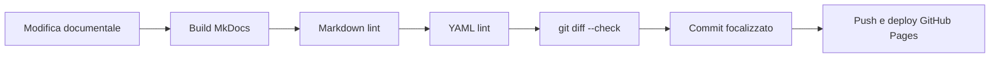

# Quality gates

I quality gates definiscono quando un contenuto può essere considerato pronto per la knowledge base.

!!! success "Criterio generale"

    Una modifica è pronta solo se aiuta a decidere, eseguire, diagnosticare o
    verificare, e se supera i controlli locali richiesti.

## Definition of Done documentale

Una nuova procedura è pronta quando:

- ha un obiettivo chiaro;
- indica quando usarla;
- contiene passaggi verificabili;
- include una verifica finale;
- non contiene dati sensibili;
- rimanda a standard, decisioni o casi pratici collegati;
- è collocata nella sezione corretta.

## Quality gate repository

Prima di pubblicare modifiche strutturali o documentali, la repository deve
superare i controlli locali di validazione.

Comandi ufficiali:

```powershell
mkdocs build --strict
npx --yes markdownlint-cli2
yamllint mkdocs.yml .github/workflows
```

I controlli hanno questo scopo:

- `mkdocs build --strict` verifica build, navigazione e link interni gestiti
  da MkDocs;
- `npx --yes markdownlint-cli2` verifica la forma dei file Markdown secondo
  la configurazione della repository;
- `yamllint mkdocs.yml .github/workflows` verifica la sintassi e lo stile dei
  file YAML principali.

Processo consigliato:



Una modifica è pronta per il push quando:

- i tre controlli terminano senza errori;
- eventuali warning residui sono compresi e non bloccanti;
- `git diff --check` non segnala spazi o caratteri problematici;
- i file generati localmente, come `site/`, non vengono committati;
- le modifiche non introducono dati cliente, commessa o informazioni non
  pubblicabili.

## Quality gate per simboli custom

Un simbolo custom è documentabile come stabile quando:

- è stato inserito in un progetto prova;
- gli attributi sono verificati;
- la pinatura è testata, se presente;
- lo stato è indicato nell'inventario;
- eventuali limitazioni sono annotate.

## Quality gate per archivi materiali

Un archivio materiali è documentabile come stabile quando:

- esiste un backup dello stato precedente;
- i dati sono normalizzati;
- i codici catalogo sono reali e non fittizi o basati su iniziali personali;
- i duplicati sono stati controllati;
- l'import è stato testato in ambiente non critico;
- almeno un materiale è stato associato a un simbolo;
- distinta o report sono stati verificati;
- il file pubblicato, se presente, è tracciato e sanitizzato;
- ogni record ha uno stato chiaro.

## Quality gate per Archivio Cavi DbCables

Un `DbCables.db` custom è rilasciabile solo quando:

- il database originale è stato salvato come backup;
- l'integrity check SQLite è OK;
- non sono presenti codici cavo duplicati indesiderati;
- ogni cavo ha conduttori coerenti nella tabella dedicata;
- i campi tecnici principali sono popolati;
- i cavi custom sono marcati con campi di tracciabilità;
- i codici catalogo sono reali e non fittizi o basati su iniziali personali;
- SPAC avvia il controllo versione;
- l'allineamento versione librerie è completato;
- SPAC viene riaperto dopo l'allineamento;
- Archivio Cavi è consultabile;
- almeno un cavo custom è selezionabile;
- almeno un cavo reale con codice produttore verificabile è testato;
- il pannello dati tecnici è popolato;
- i conduttori sono visibili;
- il test posa cavo è stato eseguito;
- il rollback è verificabile.

## Quality gate DbCables cross-version

Quando l'archivio è destinato a più ambienti, la validazione deve essere ripetuta sia su SPAC Automazione sia su SPAC Start.

| Controllo | SPAC Automazione | SPAC Start | Esito richiesto |
|---|---|---|---|
| Avvio software | OK | OK | Entrambi validi |
| Allineamento librerie | OK | OK | Entrambi validi |
| Archivio Cavi consultabile | OK | OK | Entrambi validi |
| Ricerca cavo custom | OK | OK | Entrambi validi |
| Dati tecnici visibili | OK | OK | Entrambi validi |
| Conduttori coerenti | OK | OK | Entrambi validi |
| Posa cavo testata | OK | OK | Entrambi validi |
| Rollback verificato | OK | OK | Entrambi validi |

Se uno dei due ambienti fallisce, lo stato finale resta **Da verificare**.

## Quality gate per download

Un file può essere pubblicato in `docs/assets/downloads/` solo quando:

- è privo di dati cliente, commessa o informazioni non pubblicabili;
- il nome file è chiaro, senza spazi e con versione o release;
- il contenuto è apribile e verificato;
- provenienza o criterio di generazione sono documentati;
- l'hash SHA256 è registrato per i file binari;
- l'archivio compresso, se presente, è stato testato;
- la pagina [Download](downloads.md) riporta stato e note;
- il file è collegato a una procedura o a un quality gate;
- il link viene verificato dopo build del sito.

## Quality gate per troubleshooting

Una nota di troubleshooting è pronta quando:

- descrive il sintomo;
- indica cause probabili;
- propone una diagnosi;
- include una soluzione;
- indica come prevenire il problema.

## Quality gate per decisioni

Una decisione è pronta quando:

- il contesto è chiaro;
- la scelta è esplicita;
- la motivazione è documentata;
- l'impatto è comprensibile;
- lo stato è assegnato.

## Regola finale

Se un contenuto non aiuta a decidere, risolvere, standardizzare o verificare, deve essere semplificato o rimosso.

## Baseline sezione

I quality gates sono completi come riferimento operativo quando coprono:

- procedure documentali;
- simboli custom;
- archivi materiali;
- Archivio Cavi DbCables;
- download pubblici;
- troubleshooting;
- decisioni operative.

Ogni nuova area deve aggiungere un quality gate solo se introduce un rischio o una verifica non già coperta.
