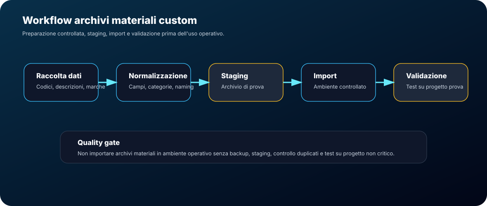

# Archivi materiali custom

Questa sezione definisce un workflow controllato per preparare, importare e validare archivi materiali personalizzati.

## Obiettivo

Gestire materiali custom in modo ordinato, evitando duplicazioni, import non controllati e dati non coerenti.

La guida non sostituisce la procedura ufficiale del software: definisce un metodo operativo sicuro da seguire prima di importare o consolidare archivi materiali.

## Principio operativo

Un archivio materiali non deve essere importato direttamente in ambiente operativo senza:

- backup;
- normalizzazione dati;
- controllo duplicati;
- import in ambiente di prova;
- validazione su progetto non critico;
- documentazione della provenienza.

## Ambiti da distinguere

Nel workflow materiali distinguere sempre questi livelli.

| Livello | Scopo | Verifica minima |
|---|---|---|
| Archivio materiali | Contiene i record disponibili per ricerca e associazione | Record ricercabile e dati coerenti |
| Materiale associato al simbolo | Collega un record materiale a un oggetto SPAC | Simbolo riconosciuto e associazione stabile |
| Distinta o report | Mostra i materiali estratti dal progetto | Nessuna duplicazione o omissione |
| File scaricabile | Pubblica una versione riutilizzabile dell'archivio | File tracciato, sanitizzato e verificato |

Un archivio è pronto solo quando record, associazione, distinta/report e file
pubblicato sono coerenti tra loro.

## Workflow consigliato

1. **Raccolta dati**  
   Raccogliere codici, descrizioni, costruttori e categorie.

2. **Normalizzazione**  
   Uniformare nomi, descrizioni, categorie e campi obbligatori.

3. **Staging**  
   Preparare un archivio di prova separato da quello operativo.

4. **Backup**  
   Salvare lo stato precedente dell'archivio materiali.

5. **Import controllato**  
   Importare in ambiente di test o progetto non critico.

6. **Validazione**  
   Verificare ricerca, associazione ai simboli, distinta e report.

7. **Promozione**  
   Solo dopo validazione, rendere l'archivio disponibile come standard.

8. **Pubblicazione controllata**
   Pubblicare il file solo se è generico, riutilizzabile, tracciato e privo di
   dati cliente o commessa.

## Campi consigliati

Per ogni materiale, mantenere almeno queste informazioni:

| Campo | Scopo |
|---|---|
| Codice | Codice articolo o identificativo materiale |
| Descrizione | Descrizione tecnica sintetica |
| Costruttore | Marca o produttore |
| Categoria | Famiglia funzionale |
| Tipo | Tipologia tecnica |
| Note | Informazioni operative o limitazioni |
| Stato | Bozza, Da verificare, Validato, Deprecato |

## Regola codici catalogo

I codici articolo o catalogo devono essere reali e verificabili.

Regole:

- usare codici produttore o codici aziendali realmente definiti;
- non creare codici fittizi per chiudere una riga incompleta;
- non inserire iniziali personali nei codici catalogo;
- se il codice non è verificato, impostare lo stato `Da verificare`;
- usare note o campi dedicati per release, provenienza o limitazioni.

Un record senza codice verificato non deve essere promosso a standard.

## Stati materiali

| Stato | Significato |
|---|---|
| Bozza | Materiale inserito ma non verificato |
| Da verificare | Materiale plausibile ma non ancora validato in progetto prova |
| Validato | Materiale testato e pronto per il riuso |
| Deprecato | Materiale da non usare per nuovi progetti |

## Controllo duplicati

Prima dell'import controllare duplicati su:

- codice articolo;
- costruttore;
- descrizione simile;
- categoria;
- variante tecnica.

Quando due record sembrano simili, non unificarli automaticamente: verificare se rappresentano davvero lo stesso materiale.

## Checklist pre-aggiornamento

Prima di creare o aggiornare un archivio materiali custom:

- backup dell'archivio originale presente;
- sorgente dati identificata;
- codici catalogo reali e verificabili;
- nessuna iniziale personale nei codici catalogo;
- descrizioni normalizzate;
- costruttori e categorie coerenti;
- duplicati controllati;
- stato assegnato a ogni record;
- ambiente o progetto di prova disponibile;
- file destinato al download tracciato con versione, data e provenienza.

## Import in ambiente di prova

La prima importazione deve avvenire in ambiente controllato.

Checklist:

- archivio originale salvato;
- file da importare verificato;
- categorie coerenti;
- campi obbligatori compilati;
- duplicati controllati;
- progetto prova disponibile;
- report materiali verificabile.

Se la modalità di import varia in base all'installazione o alla versione SPAC,
marcare il passaggio come `Da verificare` e documentare ambiente e risultato.

## Validazione su simboli

Dopo l'import:

1. selezionare un simbolo coerente;
2. associare il materiale importato;
3. verificare che il materiale sia ricercabile;
4. generare report o distinta;
5. controllare descrizione e costruttore;
6. verificare che non compaiano duplicazioni.

## Checklist post-aggiornamento

Dopo import o aggiornamento:

- archivio consultabile;
- record materiale ricercabile;
- codice catalogo coerente e non fittizio;
- materiale associabile a un simbolo riconosciuto;
- distinta o report generato senza duplicazioni;
- dati principali leggibili e coerenti;
- file scaricabile aggiornato solo se sanitizzato e tracciato;
- rollback tecnicamente possibile tramite backup.

## Regole di governance

- Non importare materiali non verificati in un archivio stabile.
- Non cancellare record storici senza decisione documentata.
- Non usare descrizioni troppo generiche.
- Non usare codici catalogo fittizi o con iniziali personali.
- Non mischiare materiali validati e bozze senza stato.
- Aggiornare il changelog quando un archivio diventa standard.

## Checklist finale

Un archivio materiali è pronto quando:

- i dati sono normalizzati;
- i codici catalogo sono reali e verificabili;
- i duplicati sono controllati;
- l'import è stato testato;
- almeno un materiale è stato associato a un simbolo;
- distinta o report sono stati verificati;
- lo stato dei record è documentato.

## Baseline sezione

La sezione archivi materiali è completa come riferimento operativo quando definisce:

- principio di backup e staging;
- campi minimi consigliati;
- regole sui codici catalogo;
- stati ammessi dei record;
- controllo duplicati;
- import in ambiente di prova;
- validazione su simboli;
- checklist pre/post aggiornamento;
- criteri per promuovere l'archivio a standard.

Gli archivi reali e i codici articolo non devono essere pubblicati nella guida.

## Collegamenti

- [Download](downloads.md)
- [Associare materiali](playbooks/material-association.md)
- [Standard materiali](standards/materials.md)
- [Back-check e controlli incrociati](26-back-check-controls.md)
- [Simboli custom](03-custom-symbols.md)
- [Quality gates](14-quality-gates.md)
- [Decision log](11-decision-log.md)
