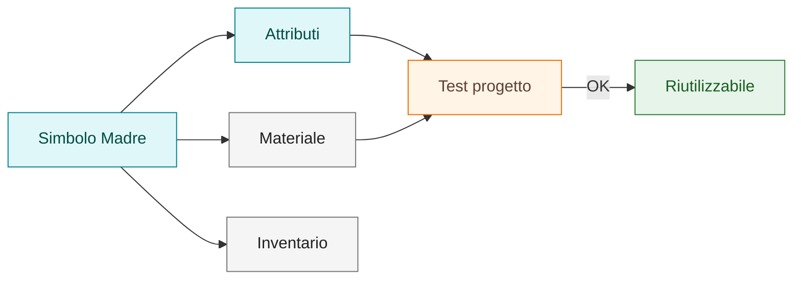
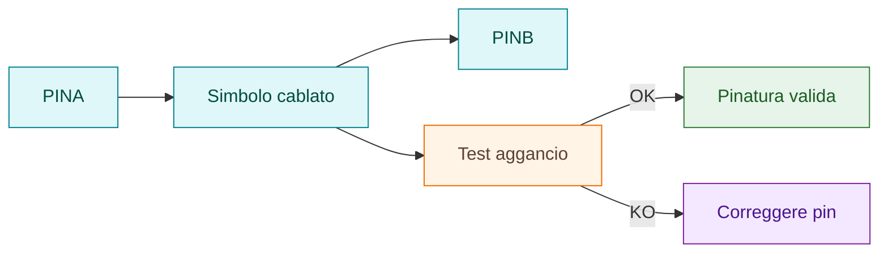
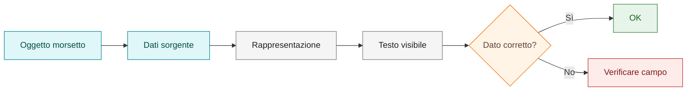
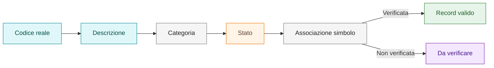

# Esempi operativi

Questa sezione raccoglie esempi generici, non legati a commesse reali, utili per spiegare procedure e standard della knowledge base.

## Obiettivo

Fornire riferimenti visuali semplici per chiarire concetti ricorrenti:

- simbolo Madre;
- simbolo cablato;
- rappresentazione morsetto;
- record materiale.

## Esempio 1 — Simbolo Madre

Un simbolo Madre rappresenta il componente principale. Può avere materiale associabile anche quando non ha pin.

Verifiche minime:

- ruolo del simbolo chiaro;
- attributi principali presenti;
- eventuale materiale associato al componente corretto;
- inventario aggiornato.

## Esempio 2 — Simbolo cablato

Un simbolo cablato deve avere punti di connessione coerenti. Se il segnale deve attraversare il simbolo, la relazione tra ingresso e uscita deve essere chiara.

Verifiche minime:

- pin allineati;
- numerazione coerente;
- aggancio filo testato;
- simbolo validato in progetto prova.

## Esempio 3 — Morsetto

La rappresentazione del morsetto deve mostrare il dato corretto. Non correggere manualmente il testo visibile senza verificare il campo sorgente.

Verifiche minime:

- morsettiera corretta;
- numero morsetto corretto;
- dato visualizzato coerente;
- rappresentazione testata su morsetto nuovo.

## Esempio 4 — Record materiale

Un materiale è pronto per il riuso solo quando i dati minimi sono coerenti e lo stato è documentato.

Verifiche minime:

- codice coerente;
- descrizione chiara;
- categoria assegnata;
- stato definito;
- associazione a simbolo verificata.

## Collegamenti

- [Simboli custom](03-custom-symbols.md)
- [Attributi e pinatura](04-attributes-and-pinning.md)
- [Rimandi, cross-reference e morsetti](06-cross-references-terminals.md)
- [Archivi materiali custom](21-material-archives.md)
- [Quality gates](14-quality-gates.md)
