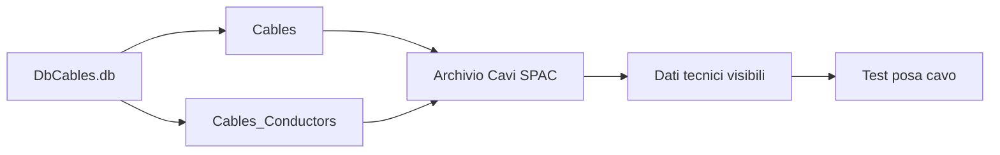

# Archivio Cavi DbCables

Questa sezione documenta il comportamento operativo dell'archivio cavi avanzato di SPAC e il metodo controllato per aggiornare il database `DbCables.db`.


!!! warning "File sensibile"

    `DbCables.db` è un database operativo. Prima di sostituirlo servono backup,
    controllo SQLite, allineamento librerie e test su cavo reale.

## Obiettivo

Gestire l'Archivio Cavi avanzato di SPAC in modo sicuro, tracciabile e reversibile.

Il focus è il database:

```text
DbCables.db
```

che è l'archivio reale utilizzato dalla finestra avanzata **Archivio Cavi**.

## Quando usarla

| Caso | Azione consigliata | Rimando |
|---|---|---|
| devi capire quale archivio cavi usa SPAC | distinguere `L_CAVI.txt` e `DbCables.db` | questa pagina |
| devi sostituire `DbCables.db` | usare backup, sostituzione controllata, allineamento e riavvio | [Aggiornare Archivio Cavi DbCables](playbooks/update-dbcables-archive.md) |
| SPAC segnala versione librerie non congruente | seguire allineamento versione librerie e verifica dopo riapertura | [Known Issue DbCables](known-issues/dbcables-version-mismatch.md) |
| devi pubblicare un archivio cavi | verificare sanitizzazione, hash, versione e download | [Download](downloads.md) |
| devi rilasciare l'archivio per uso reale | eseguire quality gate, back-check e test su cavo reale | [Quality gates](14-quality-gates.md) |

## Compatibilità verificata

La procedura di aggiornamento tramite sostituzione controllata del file `DbCables.db` è stata testata con esito positivo su:

| Ambiente | Esito | Note |
|---|---|---|
| SPAC Automazione | Verificato | Procedura funzionante con allineamento versione librerie |
| SPAC Start | Verificato | Procedura identica a SPAC Automazione |

Conclusione operativa:

> Per Archivio Cavi avanzato, il workflow `backup → sostituzione → allineamento → riavvio → verifica` è lo stesso su SPAC Automazione e SPAC Start.

## Differenza tra L_CAVI.txt e DbCables.db

`L_CAVI.txt` contiene un archivio semplice a colonne ridotte.

Formato osservato:

```text
Categoria;Costruttore;Tipo;Descrizione;Formazione;Diametro
```

La finestra avanzata Archivio Cavi di SPAC contiene invece molti più dati tecnici, tra cui:

- costruttore;
- codice cavo;
- codice interno;
- formazione;
- descrizione;
- conduttori;
- diametro esterno;
- raggio curvatura;
- materiali;
- temperatura;
- tensione;
- tabella conduttori.

Conclusione operativa:

| File | Uso |
|---|---|
| `L_CAVI.txt` | Archivio semplice o legacy |
| `DbCables.db` | Archivio avanzato usato dalla finestra Archivio Cavi |

## Percorso operativo

Percorsi osservati o attesi:

```text
C:\SPAC Automazione CAD 2025\Librerie\Archivi\DbCables.db
```

Su SPAC Start il percorso può cambiare in base all'installazione, ma la logica operativa resta la stessa: individuare la cartella `Librerie\Archivi` della propria installazione e lavorare sul file `DbCables.db` presente in quella posizione.

## Natura del database

`DbCables.db` è un database SQLite 3.

Tabelle principali osservate:

| Tabella | Funzione |
|---|---|
| `Cables` | Anagrafica principale dei cavi |
| `Cables_Conductors` | Dettaglio conduttori, colori e sezioni |
| `Colors` | Tabella colori conduttori |
| `Awg_Section` | Tabella AWG e sezioni |
| `Relationship` | Relazioni accessorie |

## Archivio, conduttori e dati visualizzati

Nel workflow DbCables distinguere sempre tre livelli.

| Livello | Contenuto | Verifica minima |
|---|---|---|
| Archivio cavi | Anagrafica del cavo e dati generali | Il cavo è ricercabile in Archivio Cavi |
| Conduttori | Dettaglio dei singoli conduttori associati al cavo | Numero e dati conduttori coerenti |
| Dati tecnici visualizzati | Campi mostrati dall'interfaccia SPAC | Pannello dati tecnici popolato e leggibile |

Un cavo è valido solo se questi tre livelli sono coerenti. La sola presenza del
record principale non basta per considerare utilizzabile il cavo.



## Regola strutturale

Per aggiungere correttamente un cavo non basta inserire una riga in `Cables`.

Devono essere coerenti almeno:

```text
Cables
Cables_Conductors
```

`Cables` contiene l'anagrafica principale.  
`Cables_Conductors` contiene il dettaglio dei singoli conduttori.

Se un cavo appare in archivio ma non mostra correttamente conduttori o dati
tecnici, controllare prima la coerenza tra archivio, conduttori e campi
visualizzati.

## Chiave logica cavo

La chiave cavo osservata segue una logica simile a:

```text
Costruttore§CodiceCostruttore
```

Esempi di forma osservata:

```text
General Cavi§N07V-K 1x1
LAPP§00100014
Prysmian§FG16M16 1x10
TKD§05000697
```

## Regola sui codici catalogo

Non creare codici catalogo fittizi, provvisori o basati su iniziali personali.

Regola operativa:

- usare codici reali del produttore quando disponibili;
- se un dato non è verificato, marcarlo come `Da verificare`;
- usare campi note o campi utente per indicare stato, release o validazione;
- non inserire iniziali personali nel codice catalogo del cavo;
- non promuovere in uso reale cavi con codice non verificato.

Se il codice produttore non è disponibile, il record resta da usare solo per
test o progettazione preliminare.

## Import/Export

La funzione Import/Export può rifiutare database custom generati manualmente.

Sintomo osservato:

```text
Il DB scelto non è un DB di SPAC valido
```

Decisione operativa: non usare Import/Export per questo workflow se nella propria installazione produce questo errore.

## Metodo funzionante

Il metodo verificato è la sostituzione diretta controllata del file `DbCables.db`, seguita dall'allineamento versione librerie tramite SPAC.

Sintesi:

1. backup del database originale;
2. sostituzione controllata;
3. avvio SPAC;
4. allineamento versione librerie;
5. riapertura SPAC;
6. validazione dell'archivio.

## Workflow con allineamento versione librerie

Quando SPAC segnala che `DbCables.db` non è congruente con la versione del
programma, seguire il flusso controllato.

1. Confermare l'avviso di versione non congruente.
2. Aprire la finestra di ripristino o allineamento proposta da SPAC.
3. Usare il pulsante o l'azione:

   ```text
   Allinea la versione delle librerie
   ```

4. Attendere il completamento dell'allineamento.
5. Chiudere la finestra di allineamento.
6. Se SPAC si chiude o richiede riavvio, riaprire SPAC.
7. Aprire Archivio Cavi.
8. Verificare ricerca, dettaglio tecnico, conduttori e posa cavo.

Se il comportamento della finestra cambia nella propria installazione, segnare
il caso come `Da verificare` e documentare ambiente, versione e messaggio.

## Checklist pre-aggiornamento

Prima di sostituire `DbCables.db`:

- SPAC chiuso;
- backup del `DbCables.db` originale presente e ripristinabile;
- database modificato pronto e rinominabile in `DbCables.db`;
- integrity check SQLite eseguito senza errori;
- confronto tra record cavi e conduttori eseguito;
- assenza di codici catalogo fittizi o con iniziali personali;
- cavi custom marcati con stato, release o nota di validazione;
- almeno un cavo reale identificato per il test funzionale;
- ambiente di test definito.

## Checklist post-aggiornamento

Dopo sostituzione e allineamento:

- SPAC si apre senza blocchi;
- Archivio Cavi è consultabile;
- il cavo reale di test è ricercabile;
- il pannello dati tecnici è popolato;
- i conduttori sono visibili e coerenti;
- la posa cavo accetta il cavo selezionato;
- eventuale warning di versione non ricompare dopo riapertura;
- rollback verificato o almeno tecnicamente ripetibile.

## Verifica finale e controlli incrociati

Per evitare falsi positivi, la validazione deve essere fatta su più livelli.

| Controllo | Scopo | Esito atteso |
|---|---|---|
| SQLite integrity check | Verificare che il database non sia corrotto | OK |
| Confronto conteggio cavi | Verificare che gli inserimenti siano presenti | Numero coerente |
| Confronto `Cables` / `Cables_Conductors` | Verificare che ogni cavo abbia conduttori coerenti | Nessun record orfano |
| Ricerca in Archivio Cavi | Verificare visibilità da interfaccia SPAC | Cavo trovato |
| Apertura dettaglio tecnico | Verificare dati tecnici | Campi popolati |
| Test posa cavo | Verificare uso operativo | Cavo selezionabile |
| Test SPAC Automazione / SPAC Start | Verificare procedura comune | Stesso comportamento atteso |
| Rollback | Verificare reversibilità | Archivio originale ripristinabile |

## Marcatura cavi custom

Per distinguere cavi aggiunti da cavi originali, usare campi disponibili nel DB
senza alterare il codice catalogo del produttore.

Esempio:

```text
User1 = CUSTOM_R02
User2 = VERIFICARE_DATASHEET
```

Per dati verificati:

```text
User1 = CUSTOM_R03
User2 = DATASHEET_VERIFICATO
```

Questa marcatura consente:

- ricerca rapida dei cavi custom;
- tracciabilità release;
- distinzione tra dati indicativi e dati validati.

Non usare iniziali personali, codici interni provvisori o sigle arbitrarie come
codice catalogo del cavo.

## Stato dati tecnici

I cavi custom possono essere utili per test operativi, ma non devono essere considerati certificati senza verifica.

Regola:

- dati indicativi: usare solo in test o progettazione preliminare;
- dati validati: verificare su datasheet ufficiale produttore;
- uso in commessa reale: consentito solo dopo validazione tecnica.

Il test operativo deve includere almeno un cavo reale con costruttore, codice,
dati tecnici e conduttori coerenti.

## Famiglie operative tipiche

Famiglie utili per archivi custom:

- comando industriale;
- comando schermato EMC;
- segnale e strumentazione;
- bus e comunicazione industriale;
- motore inverter e servo;
- catena portacavi e robotica;
- sensori e attuatori M8/M12;
- encoder, resolver e feedback;
- safety, LSZH e halogen free.

## Collegamenti

- [Download](downloads.md)
- [Aggiornare Archivio Cavi DbCables](playbooks/update-dbcables-archive.md)
- [Known Issue — DbCables versione non congruente](known-issues/dbcables-version-mismatch.md)
- [Quality gates](14-quality-gates.md)
- [Decision log](11-decision-log.md)
