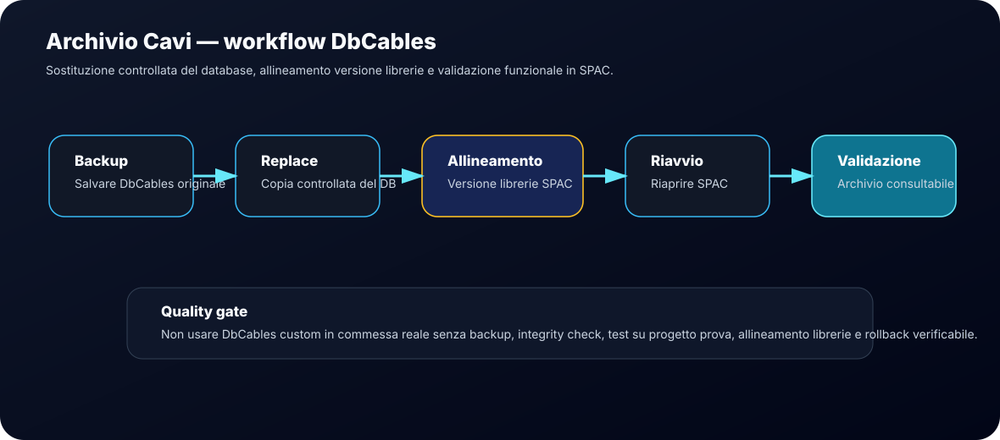
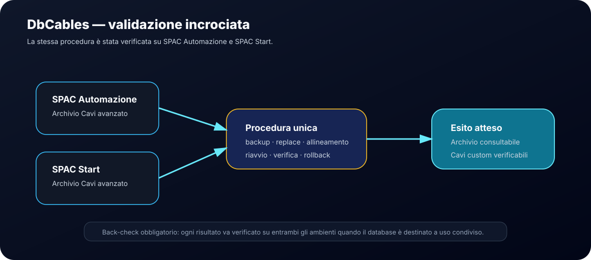

# Archivio Cavi DbCables

Questa sezione documenta il comportamento operativo dell'archivio cavi avanzato di SPAC e il metodo controllato per aggiornare il database `DbCables.db`.





## Obiettivo

Gestire l'Archivio Cavi avanzato di SPAC in modo sicuro, tracciabile e reversibile.

Il focus è il database:

```text
DbCables.db
```

che è l'archivio reale utilizzato dalla finestra avanzata **Archivio Cavi**.

## Compatibilità verificata

La procedura di aggiornamento tramite sostituzione controllata del file `DbCables.db` è stata testata con esito positivo su:

| Ambiente | Esito | Note |
|---|---|---|
| SPAC Automazione | Verificato | Procedura funzionante con allineamento versione librerie |
| SPAC Start | Verificato | Procedura identica a SPAC Automazione |

Conclusione operativa:

> Per Archivio Cavi avanzato, il workflow `backup → sostituzione → allineamento → riavvio → verifica` è lo stesso su SPAC Automazione e SPAC Start.

## Differenza tra L_CAVI.txt e DbCables.db

`L_CAVI.txt` contiene un archivio semplice a colonne ridotte.

Formato osservato:

```text
Categoria;Costruttore;Tipo;Descrizione;Formazione;Diametro
```

La finestra avanzata Archivio Cavi di SPAC contiene invece molti più dati tecnici, tra cui:

- costruttore;
- codice cavo;
- codice interno;
- formazione;
- descrizione;
- conduttori;
- diametro esterno;
- raggio curvatura;
- materiali;
- temperatura;
- tensione;
- tabella conduttori.

Conclusione operativa:

| File | Uso |
|---|---|
| `L_CAVI.txt` | Archivio semplice o legacy |
| `DbCables.db` | Archivio avanzato usato dalla finestra Archivio Cavi |

## Percorso operativo

Percorsi osservati o attesi:

```text
C:\SPAC Automazione CAD 2025\Librerie\Archivi\DbCables.db
```

Su SPAC Start il percorso può cambiare in base all'installazione, ma la logica operativa resta la stessa: individuare la cartella `Librerie\Archivi` della propria installazione e lavorare sul file `DbCables.db` presente in quella posizione.

## Natura del database

`DbCables.db` è un database SQLite 3.

Tabelle principali osservate:

| Tabella | Funzione |
|---|---|
| `Cables` | Anagrafica principale dei cavi |
| `Cables_Conductors` | Dettaglio conduttori, colori e sezioni |
| `Colors` | Tabella colori conduttori |
| `Awg_Section` | Tabella AWG e sezioni |
| `Relationship` | Relazioni accessorie |

## Regola strutturale

Per aggiungere correttamente un cavo non basta inserire una riga in `Cables`.

Devono essere coerenti almeno:

```text
Cables
Cables_Conductors
```

`Cables` contiene l'anagrafica principale.  
`Cables_Conductors` contiene il dettaglio dei singoli conduttori.

## Chiave logica cavo

La chiave cavo osservata segue una logica simile a:

```text
Costruttore§CodiceCostruttore
```

Esempi di forma osservata:

```text
General Cavi§N07V-K 1x1
LAPP§00100014
Prysmian§FG16M16 1x10
TKD§05000697
```

## Import/Export

La funzione Import/Export può rifiutare database custom generati manualmente.

Sintomo osservato:

```text
Il DB scelto non è un DB di SPAC valido
```

Decisione operativa: non usare Import/Export per questo workflow se nella propria installazione produce questo errore.

## Metodo funzionante

Il metodo verificato è la sostituzione diretta controllata del file `DbCables.db`, seguita dall'allineamento versione librerie tramite SPAC.

Sintesi:

1. backup del database originale;
2. sostituzione controllata;
3. avvio SPAC;
4. allineamento versione librerie;
5. riapertura SPAC;
6. validazione dell'archivio.

## Back-check e controlli incrociati

Per evitare falsi positivi, la validazione deve essere fatta su più livelli.

| Controllo | Scopo | Esito atteso |
|---|---|---|
| SQLite integrity check | Verificare che il database non sia corrotto | OK |
| Confronto conteggio cavi | Verificare che gli inserimenti siano presenti | Numero coerente |
| Confronto `Cables` / `Cables_Conductors` | Verificare che ogni cavo abbia conduttori coerenti | Nessun record orfano |
| Ricerca in Archivio Cavi | Verificare visibilità da interfaccia SPAC | Cavo trovato |
| Apertura dettaglio tecnico | Verificare dati tecnici | Campi popolati |
| Test posa cavo | Verificare uso operativo | Cavo selezionabile |
| Test SPAC Automazione / SPAC Start | Verificare procedura comune | Stesso comportamento atteso |
| Rollback | Verificare reversibilità | Archivio originale ripristinabile |

## Marcatura cavi custom

Per distinguere cavi aggiunti da cavi originali, usare campi disponibili nel DB.

Esempio:

```text
User1 = RC_R02
User2 = VERIFICARE_DATASHEET
```

Per dati verificati:

```text
User1 = RC_R03
User2 = DATASHEET_VERIFICATO
```

Questa marcatura consente:

- ricerca rapida dei cavi custom;
- tracciabilità release;
- distinzione tra dati indicativi e dati validati.

## Stato dati tecnici

I cavi custom possono essere utili per test operativi, ma non devono essere considerati certificati senza verifica.

Regola:

- dati indicativi: usare solo in test o progettazione preliminare;
- dati validati: verificare su datasheet ufficiale produttore;
- uso in commessa reale: consentito solo dopo validazione tecnica.

## Famiglie operative tipiche

Famiglie utili per archivi custom:

- comando industriale;
- comando schermato EMC;
- segnale e strumentazione;
- bus e comunicazione industriale;
- motore inverter e servo;
- catena portacavi e robotica;
- sensori e attuatori M8/M12;
- encoder, resolver e feedback;
- safety, LSZH e halogen free.

## Collegamenti

- [Aggiornare Archivio Cavi DbCables](playbooks/update-dbcables-archive.md)
- [Back-check e controlli incrociati](26-back-check-controls.md)
- [Known Issue — DbCables versione non congruente](known-issues/dbcables-version-mismatch.md)
- [Quality gates](14-quality-gates.md)
- [Decision log](11-decision-log.md)
