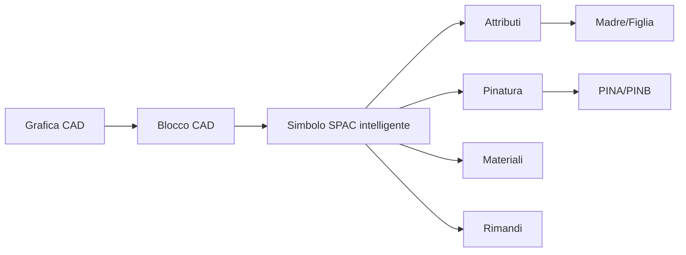
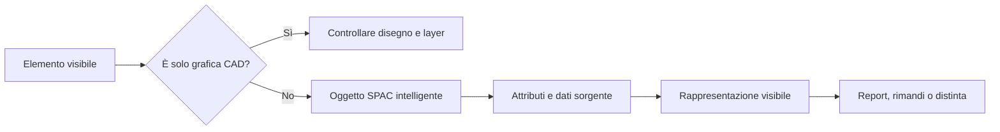

# Concetti SPAC

Questa pagina raccoglie i concetti fondamentali usati nella knowledge base.

## In questa pagina impari

- la differenza tra geometria CAD e oggetto SPAC intelligente;
- perché attributi, pinatura e dati sorgente non sono semplice testo;
- quando un problema va cercato nella rappresentazione e non nel disegno;
- quali pagine usare per approfondire simboli, morsetti, rimandi e materiali.

## Mappa concettuale

## Distinzione operativa

Molti problemi nascono quando un elemento visibile viene scambiato per un dato
logico SPAC. Usare questa tabella prima di correggere graficamente un oggetto.

| Elemento | È | Non è | Dove approfondire |
|---|---|---|---|
| Grafica CAD | geometria visibile nel disegno | un collegamento logico SPAC | [Workflow CAD 2D](02-cad-workflow.md) |
| Blocco CAD | gruppo riutilizzabile di entità | garanzia di comportamento elettrico | [Simboli custom](03-custom-symbols.md) |
| Simbolo SPAC intelligente | oggetto riconosciuto con dati e relazioni | solo una forma grafica | [Attributi e pinatura](04-attributes-and-pinning.md) |
| Attributi | dati associati al simbolo | testo libero senza effetto operativo | [Checklist validazione simbolo](10-symbol-validation-checklist.md) |
| Dati sorgente | informazione usata da report, rimandi o rappresentazioni | necessariamente il testo visibile nel foglio | [Rimandi e morsetti](06-cross-references-terminals.md) |
| Rappresentazione | modo in cui un dato viene mostrato | prova che il dato sorgente sia corretto | [Verificare rappresentazione morsetti](playbooks/terminal-representation.md) |

Il percorso corretto di diagnosi è questo.

!!! warning "Errore tipico"

    Se il testo visibile è sbagliato, non modificarlo manualmente prima di
    avere controllato oggetto, attributi, dato sorgente e rappresentazione.

## Grafica CAD

È semplice geometria. Può essere utile per disegno 2D, layout, cornici o elementi non elettrici, ma non ha automaticamente logica SPAC.

## Blocco CAD

È un insieme di entità raggruppate. Può essere comodo per il riuso grafico, ma non garantisce che SPAC lo riconosca come componente.

## Simbolo SPAC intelligente

È un oggetto riconosciuto da SPAC e gestibile tramite attributi, pinatura, relazioni e associazioni.

## Attributi

Gli attributi sono il livello informativo del simbolo. Permettono di gestire nome, descrizione, tipo, costruttore, quadro e ruolo del simbolo.

## Pinatura

La pinatura definisce i punti di connessione. In questa knowledge base si usa lo standard PINA/PINB.

## Madre/Figlia

La Madre è il componente principale. La Figlia è un elemento associato. La relazione deve essere chiara, documentata e testata.

## Rimandi e cross-reference

I rimandi servono a mantenere coerenza tra fogli, collegamenti e riferimenti. Non devono essere trattati come pura grafica.

## Regola chiave

Prima di correggere un problema visivo, capire se il problema è:

- grafico;
- attributivo;
- logico;
- di configurazione;
- di riferimento.
