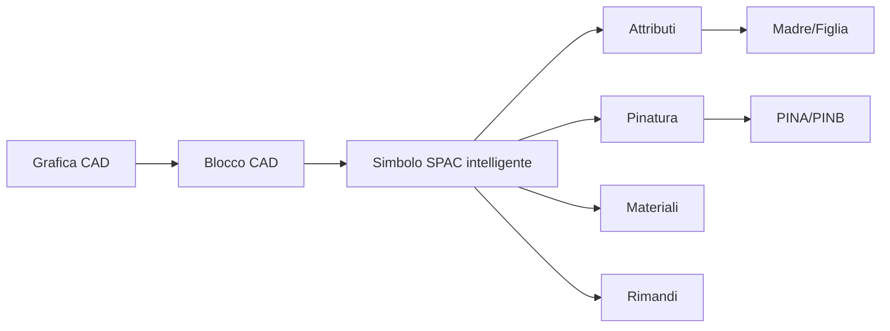

# Concetti SPAC

Questa pagina raccoglie i concetti fondamentali usati nella knowledge base.

## Mappa concettuale

## Grafica CAD

È semplice geometria. Può essere utile per disegno 2D, layout, cornici o elementi non elettrici, ma non ha automaticamente logica SPAC.

## Blocco CAD

È un insieme di entità raggruppate. Può essere comodo per il riuso grafico, ma non garantisce che SPAC lo riconosca come componente.

## Simbolo SPAC intelligente

È un oggetto riconosciuto da SPAC e gestibile tramite attributi, pinatura, relazioni e associazioni.

## Attributi

Gli attributi sono il livello informativo del simbolo. Permettono di gestire nome, descrizione, tipo, costruttore, quadro e ruolo del simbolo.

## Pinatura

La pinatura definisce i punti di connessione. In questa knowledge base si usa lo standard PINA/PINB.

## Madre/Figlia

La Madre è il componente principale. La Figlia è un elemento associato. La relazione deve essere chiara, documentata e testata.

## Rimandi e cross-reference

I rimandi servono a mantenere coerenza tra fogli, collegamenti e riferimenti. Non devono essere trattati come pura grafica.

## Regola chiave

Prima di correggere un problema visivo, capire se il problema è:

- grafico;
- attributivo;
- logico;
- di configurazione;
- di riferimento.
