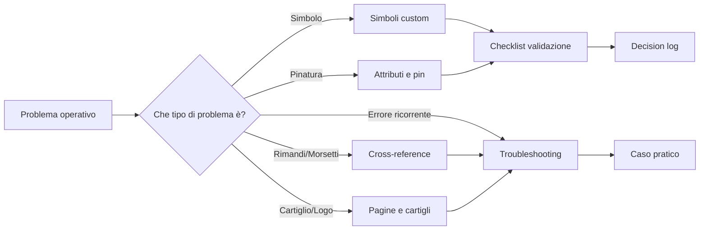

# SPAC Start Knowledge Base

Knowledge base operativa per **SPAC Start Impianti**, pensata per trasformare prove, procedure e standard in documentazione tecnica consultabile.

!!! note "Obiettivo"
    Portare ordine nei workflow SPAC: simboli custom, attributi, pinatura, cartigli, rimandi, morsetti, troubleshooting e standard documentali.

## Mappa operativa

## Accesso rapido

| Necessità | Vai a |
|---|---|
| Capire struttura e scopo | [Overview](00-overview.md) |
| Creare o revisionare un simbolo custom | [Simboli custom](03-custom-symbols.md) |
| Controllare attributi e pinatura | [Attributi e pinatura](04-attributes-and-pinning.md) |
| Validare un simbolo prima del riuso | [Checklist validazione simbolo](10-symbol-validation-checklist.md) |
| Risolvere un problema ricorrente | [Troubleshooting](07-troubleshooting.md) |
| Consultare decisioni operative | [Decision log](11-decision-log.md) |
| Standardizzare il modo di lavorare | [Standard operativi](08-standards.md) |

## Principi guida

- Documentare procedure realmente utili.
- Separare standard, procedure, decisioni e casi pratici.
- Non inserire dati sensibili o specifici di commessa.
- Preferire checklist e flussi operativi a descrizioni teoriche.
- Aggiornare il decision log quando una scelta diventa standard.

## Stato attuale

| Area | Stato |
|---|---|
| Base documentale | Avviata |
| Simboli custom | In consolidamento |
| Attributi e pinatura | In consolidamento |
| Workflow CAD | In consolidamento |
| Rimandi e morsetti | In corso |
| Multifilare | Da sviluppare |
| Casi pratici | Avviati |
| Governance documentale | Avviata |

## Prossimo livello

Le prossime evoluzioni chiave sono:

1. completare la sezione multifilare;
2. aggiungere screenshot non sensibili;
3. creare known issues dedicati;
4. collegare ogni caso pratico a una decisione o a uno standard;
5. consolidare una release `1.0.0` come primo standard stabile.
