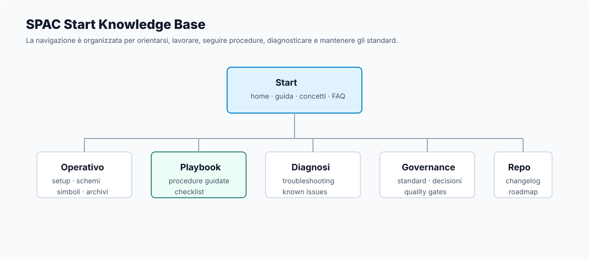

# SPAC Start Knowledge Base

Knowledge base operativa per **SPAC Start Impianti**, pensata per trasformare prove, procedure e standard in documentazione tecnica consultabile.

!!! note "Obiettivo"
    Portare ordine nei workflow SPAC: simboli custom, attributi, pinatura, cartigli, rimandi, morsetti, materiali, cavi, troubleshooting e standard documentali.

## Accesso rapido

| Necessità | Vai a |
|---|---|
| Capire struttura e scopo | [Overview](00-overview.md) |
| Installare o mantenere la libreria custom | [Libreria custom](15-custom-library.md) |
| Creare o revisionare un simbolo custom | [Simboli custom](03-custom-symbols.md) |
| Controllare attributi e pinatura | [Attributi e pinatura](04-attributes-and-pinning.md) |
| Gestire archivi materiali custom | [Archivi materiali custom](21-material-archives.md) |
| Aggiornare Archivio Cavi DbCables | [Archivio Cavi DbCables](25-cable-archive-dbcables.md) |
| Consultare esempi operativi | [Esempi operativi](24-operational-examples.md) |
| Validare un simbolo prima del riuso | [Checklist validazione simbolo](10-symbol-validation-checklist.md) |
| Risolvere un problema ricorrente | [Troubleshooting](07-troubleshooting.md) |
| Consultare decisioni operative | [Decision log](11-decision-log.md) |
| Standardizzare il modo di lavorare | [Standard operativi](08-standards.md) |

## Mappa logica

| Area | Contenuti principali |
|---|---|
| Workflow | interfaccia, libreria custom, template progetto, CAD 2D |
| Schemi | unifilare, multifilare, rimandi, morsetti |
| Simboli | simboli custom, attributi, pinatura, nomenclatura |
| Archivi | materiali custom, Archivio Cavi DbCables, validazione dati |
| Diagnostica | troubleshooting, known issues, casi pratici |
| Governance | decision log, quality gates, manutenzione |

## Come usare questa guida

1. Parti dal problema operativo.
2. Vai alla sezione dedicata.
3. Segui il playbook o la checklist.
4. Verifica il risultato in un progetto di prova.
5. Aggiorna decision log, standard o casi pratici se emerge una nuova regola.

## Principi guida

- Documentare procedure realmente utili.
- Separare standard, procedure, decisioni e casi pratici.
- Non inserire dati sensibili o specifici di commessa.
- Preferire checklist e flussi operativi a descrizioni teoriche.
- Aggiornare il decision log quando una scelta diventa standard.
- Non considerare stabile una procedura senza verifica finale.

## Stato attuale

| Area | Stato |
|---|---|
| Base documentale | Avviata |
| Simboli custom | In consolidamento |
| Attributi e pinatura | In consolidamento |
| Workflow CAD | In consolidamento |
| Rimandi e morsetti | In corso |
| Materiali custom | Avviata |
| Archivio Cavi DbCables | Verificato su SPAC Automazione e SPAC Start |
| Esempi operativi | Avviati |
| Multifilare | In sviluppo |
| Casi pratici | Avviati |
| Governance documentale | Avviata |

## Prossimo livello

Le prossime evoluzioni chiave sono:

1. completare la sezione multifilare;
2. aggiungere screenshot non sensibili;
3. creare known issues dedicati;
4. collegare ogni caso pratico a una decisione o a uno standard;
5. consolidare una baseline stabile come primo standard operativo.
