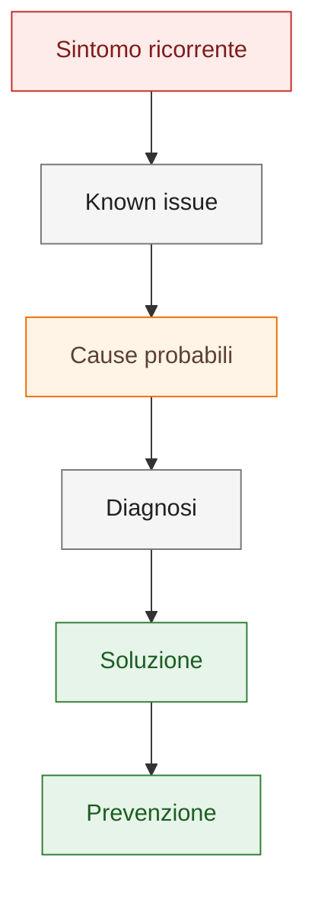

# Known Issues

Questa sezione raccoglie problemi noti, sintomi ricorrenti e procedure di diagnosi.

## Quando usarla

Usare una known issue quando il problema è ripetibile, ha sintomi chiari e può
essere diagnosticato con controlli stabili. Per un singolo caso non ancora
confermato usare prima [Troubleshooting generale](../07-troubleshooting.md).

## Issues disponibili

| Problema | Sintomo | Prima pagina collegata |
|---|---|---|
| [Pin non agganciato](pin-not-snapping.md) | Il filo non si collega al pin del simbolo | [Attributi e pinatura](../04-attributes-and-pinning.md) |
| [Riferimento immagine mancante](missing-image-reference.md) | Logo o immagine non visibile nel cartiglio | [Pagine, cartigli e immagini](../05-pages-titleblocks-images.md) |
| [Cross-reference obsoleto](obsolete-cross-reference.md) | Rimando verso posizione non più valida | [Rimandi e morsetti](../06-cross-references-terminals.md) |
| [DbCables versione non congruente](dbcables-version-mismatch.md) | Avviso di versione database non congruente dopo sostituzione | [Archivio Cavi DbCables](../25-cable-archive-dbcables.md) |

## Flusso di diagnosi

## Regola

Ogni known issue deve indicare:

- sintomo;
- causa probabile;
- diagnosi;
- soluzione;
- prevenzione.
