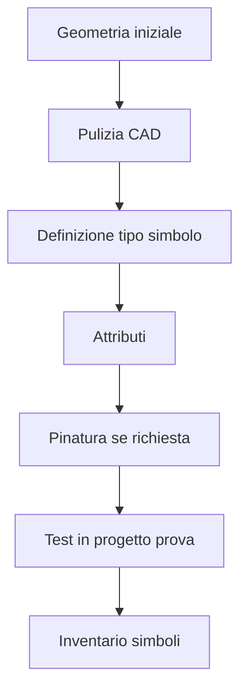

# Playbook — Creare un simbolo custom

## Obiettivo

Creare un simbolo custom ordinato, riconoscibile e riutilizzabile in SPAC Start.

## Quando usarlo

Usare questo playbook quando:

- serve creare un nuovo simbolo;
- una geometria CAD deve diventare un simbolo intelligente;
- un simbolo deve essere gestito come componente;
- il simbolo dovrà essere riutilizzato in più progetti.

## Flusso operativo



## Procedura

### 1. Preparare la geometria

- Rimuovere entità inutili.
- Verificare scala e orientamento.
- Portare le entità sul Layer 0.
- Evitare dettagli grafici non necessari.

### 2. Definire il tipo simbolo

Stabilire se il simbolo è:

- Madre;
- Figlia;
- solo grafico;
- parte di una macro.

### 3. Gestire attributi

Verificare gli attributi principali:

- NOME;
- PRES;
- DESCRIZIONE;
- TIPO;
- COSTRUTTORE;
- QUADRO.

Per simboli Madre:

```text
PRES = M
```

### 4. Gestire pinatura

Se il simbolo è cablato:

- usare PINA con numerazione progressiva;
- usare PINB solo se il segnale deve essere riportato;
- allineare i pin alla griglia;
- testare l'aggancio filo.

### 5. Testare in progetto prova

Prima del riuso:

- inserire il simbolo in un progetto non critico;
- modificare attributi;
- collegare eventuali fili;
- verificare associazione materiale se prevista;
- controllare comportamento grafico.

### 6. Aggiornare inventario

Aggiornare l'inventario simboli con:

- nome;
- categoria;
- stato;
- pinatura;
- note operative.

## Verifica finale

Il simbolo è valido solo se:

- si inserisce correttamente;
- gli attributi sono modificabili;
- la pinatura funziona se presente;
- il simbolo è documentato;
- lo stato è aggiornato nell'inventario.

## Collegamenti

- [Simboli custom](../03-custom-symbols.md)
- [Attributi e pinatura](../04-attributes-and-pinning.md)
- [Checklist validazione simbolo](../10-symbol-validation-checklist.md)
