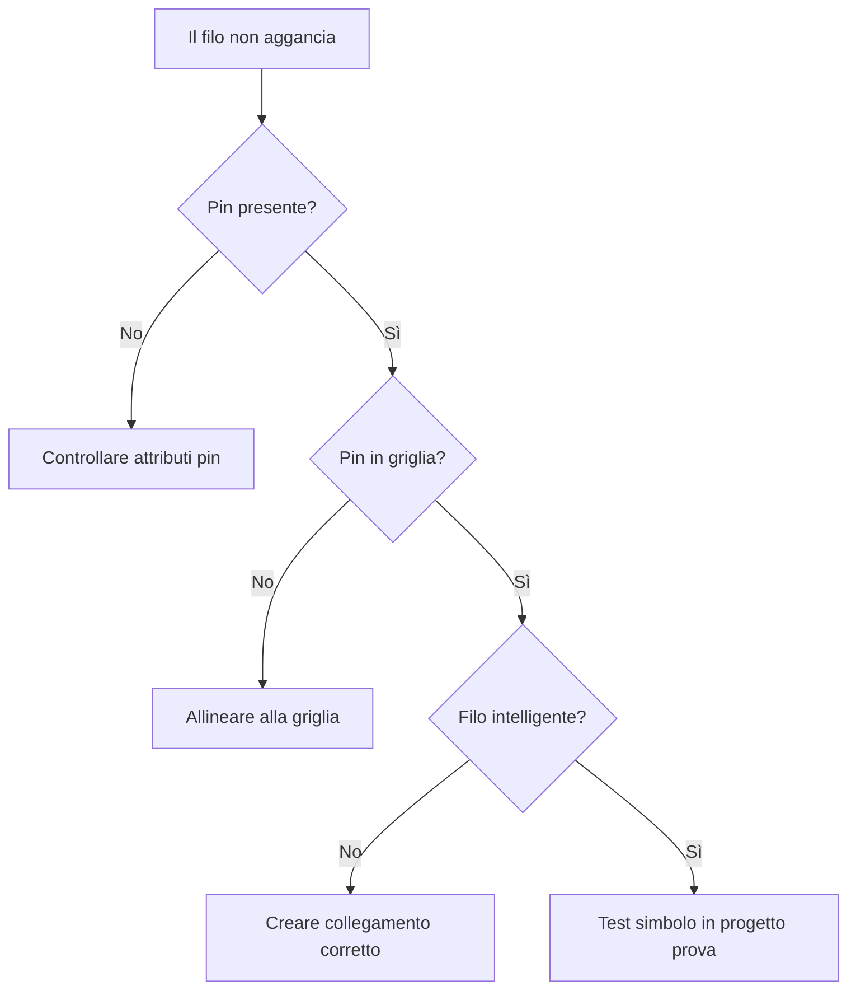

# Playbook — Diagnosticare pin non agganciato

## Obiettivo

Capire perché un filo non si aggancia correttamente al pin di un simbolo custom.

## Sintomi

- Il filo passa vicino al simbolo ma non si collega.
- Il pin non viene riconosciuto.
- La connessione è solo grafica.
- Il simbolo sembra corretto ma non partecipa alla logica del collegamento.

## Diagnosi rapida

## Procedura

### 1. Verificare attributi pin

Controllare che siano presenti attributi coerenti:

- PINA1
- PINA2
- eventuali PINB collegati

### 2. Verificare posizione

- Controllare che il punto di connessione sia allineato alla griglia.
- Evitare posizionamenti arbitrari.
- Testare con snap coerente.

### 3. Verificare il filo

Assicurarsi che il collegamento non sia una semplice linea CAD.

### 4. Testare in progetto prova

Inserire il simbolo in un progetto pulito e provare un nuovo collegamento.

## Verifica finale

Il problema è risolto quando:

- il filo si aggancia al pin;
- il collegamento è riconosciuto;
- il comportamento resta stabile dopo salvataggio e riapertura;
- il simbolo supera la checklist di validazione.

## Collegamenti

- [Attributi e pinatura](../04-attributes-and-pinning.md)
- [Checklist validazione simbolo](../10-symbol-validation-checklist.md)
