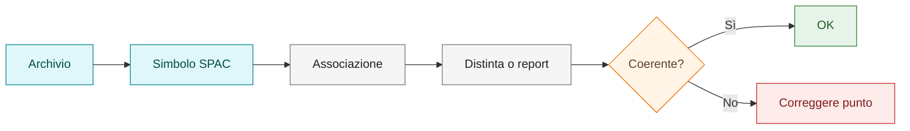

# Playbook — Associare materiali

## Obiettivo

Associare materiali in modo coerente, evitando duplicazioni o associazioni su simboli non adatti.

## Quando usarlo

Usare questo playbook quando un componente o un elemento associato deve comparire correttamente in distinta, report o documentazione materiali.

## Principio operativo

Il materiale deve essere associato al livello più coerente con la funzione del componente.

Prima di associare un materiale distinguere:

| Livello | Domanda di controllo |
|---|---|
| Archivio materiali | Il record è presente, ricercabile e verificato? |
| Simbolo SPAC | Il simbolo è riconosciuto e non è solo grafica? |
| Associazione | Il materiale è collegato al punto corretto? |
| Distinta o report | Il materiale compare una sola volta e nel punto atteso? |

## Scenari tipici

| Scenario | Approccio consigliato |
|---|---|
| Componente principale con materiale unico | Associare al simbolo principale |
| Accessorio parte del componente | Valutare associazione sul componente principale |
| Accessorio gestito separatamente | Associare al simbolo dedicato |
| Simbolo solo grafico | Non usarlo come sorgente materiale stabile |

## Prerequisiti

- Archivio materiali importato in ambiente di prova.
- Codice catalogo reale e verificabile.
- Nessuna iniziale personale nel codice catalogo.
- Stato del record assegnato.
- Backup o rollback disponibile se l'archivio è stato aggiornato.

## Procedura

### 1. Identificare il componente reale

Capire quale oggetto rappresenta il dispositivo fisico o l'accessorio da riportare.

### 2. Verificare il record materiale

Controllare codice, costruttore, descrizione, categoria e stato.

!!! warning "Da verificare"

    Se il codice catalogo non è verificato, marcarlo come `Da verificare` e non
    promuoverlo a standard.

### 3. Verificare il simbolo

Controllare che il simbolo sia riconosciuto e non sia solo grafica.

### 4. Scegliere il punto di associazione

Associare il materiale dove il dato risulta più coerente e meno ambiguo.

### 5. Verificare report o distinta

Controllare che l'associazione non generi duplicazioni o omissioni.

### 6. Documentare eccezioni

Se un caso richiede una scelta particolare, aggiungerlo al decision log o ai casi pratici.

## Verifica finale

L'associazione è corretta quando:

- il materiale compare nel punto atteso;
- non ci sono duplicazioni;
- il simbolo sorgente è coerente;
- il codice catalogo è reale e non fittizio;
- il comportamento è ripetibile.

## Collegamenti

- [Archivi materiali custom](../21-material-archives.md)
- [Standard materiali](../standards/materials.md)
- [Back-check e controlli incrociati](../26-back-check-controls.md)
- [Quality gates](../14-quality-gates.md)
- [Multifilare](../09-multifilare.md)
- [Simboli custom](../03-custom-symbols.md)
- [Decision log](../11-decision-log.md)
