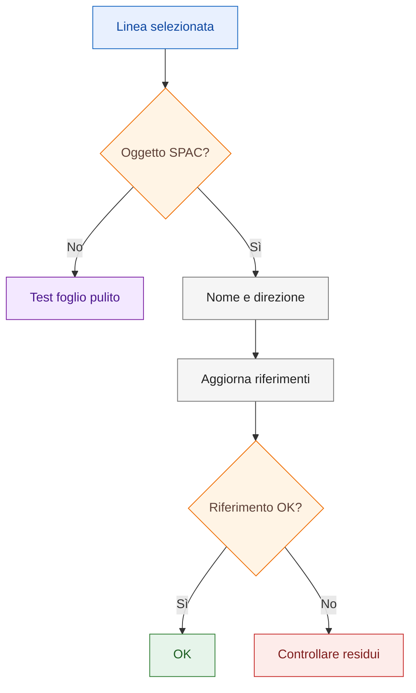

# Playbook — Diagnosticare rimandi alimentazione

## Obiettivo

Capire perché un rimando o riferimento di alimentazione non viene accettato o punta a una posizione non coerente.

## Quando usarlo

Usare questo playbook quando:

- una linea non viene riconosciuta come selezione valida;
- il riferimento punta a una posizione non aggiornata;
- un rimando sembra collegato solo graficamente;
- dopo modifiche al foglio restano riferimenti non coerenti.

## Principio operativo

Un rimando deve appoggiarsi a un oggetto riconosciuto, non a una semplice geometria.

## Distinzione iniziale

Separare sempre:

| Livello | Domanda di controllo |
|---|---|
| Linea grafica | È solo una entità CAD visibile? |
| Alimentazione SPAC | La linea è riconosciuta come alimentazione o collegamento SPAC? |
| Oggetto intelligente | L'oggetto selezionato contiene dati o relazioni coerenti? |
| Rimando | Il rimando usa nome e direzione coerenti con il punto collegato? |
| Cross-reference | Il riferimento è stato aggiornato dopo le modifiche? |

## Flusso diagnostico

## Diagnosi

Verificare:

- se l'oggetto selezionato è intelligente;
- se esistono oggetti residui;
- se il riferimento è stato aggiornato;
- se ci sono duplicazioni;
- se il collegamento è stato cancellato solo graficamente.

## Checklist prima/dopo rigenerazione

Prima di rigenerare o aggiornare i riferimenti:

- verificare che la linea non sia solo grafica CAD;
- controllare che alimentazione o collegamento siano riconosciuti;
- verificare nome e direzione dei rimandi;
- cercare rimandi duplicati o non utilizzati;
- cercare oggetti sovrapposti o residui;
- annotare i casi `Da verificare`.

Dopo la rigenerazione:

- controllare che il riferimento punti al punto atteso;
- verificare che non punti a celle o oggetti vecchi;
- controllare che non siano comparsi duplicati;
- ripetere il test su foglio pulito se il comportamento resta ambiguo.

## Procedura

### 1. Verificare l'oggetto selezionato

Assicurarsi che la selezione riguardi l'oggetto corretto e non una linea CAD sovrapposta.

### 2. Verificare alimentazione o collegamento

Controllare che la linea sia riconosciuta come alimentazione o collegamento
SPAC.

!!! warning "Da verificare"

    Se il comportamento non è verificabile nella propria installazione,
    segnare il caso come `Da verificare`.

### 3. Cercare residui

Controllare eventuali vecchi oggetti rimasti nella zona del foglio.

### 4. Rigenerare riferimenti

Aggiornare i riferimenti dopo modifiche strutturali.

### 5. Testare su foglio pulito

Riprodurre il rimando in un contesto semplice per distinguere problema locale e problema di procedura.

## Verifica finale

Il rimando è corretto quando:

- la selezione è valida;
- il riferimento punta al punto atteso;
- non esistono duplicazioni residue;
- il riferimento non punta a celle o oggetti vecchi;
- il comportamento resta stabile dopo aggiornamento.

## Collegamenti

- [Multifilare](../09-multifilare.md)
- [Rimandi, cross-reference e morsetti](../06-cross-references-terminals.md)
- [Known Issue — Cross-reference obsoleto](../known-issues/obsolete-cross-reference.md)
- [Pulire oggetti residui](clean-residual-objects.md)
