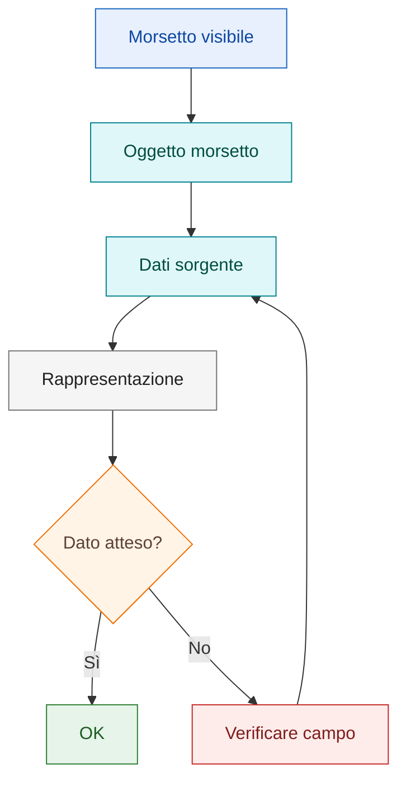

# Playbook — Verificare rappresentazione morsetti

## Obiettivo

Capire perché un morsetto mostra un'informazione diversa da quella attesa e riportare la rappresentazione a una logica coerente.

## Quando usarlo

Usare questo playbook quando sul morsetto viene visualizzato un dato non desiderato, ad esempio un riferimento diverso dal numero morsetto.

## Principio operativo

Un morsetto è un oggetto dati, non solo testo visibile. Prima di modificare graficamente la scritta, verificare il dato sorgente e la configurazione della rappresentazione.

## Distinzione iniziale

Separare sempre:

| Livello | Domanda di controllo |
|---|---|
| Oggetto morsetto | Il morsetto appartiene alla morsettiera e al filo corretti? |
| Dati sorgente | Numero morsetto, numero filo e riferimento funzionale sono coerenti? |
| Rappresentazione grafica | Il simbolo mostra il campo atteso, ad esempio `NumM`? |
| Testo visibile | Il testo è coerente con il dato che deve rappresentare? |

## Flusso diagnostico

## Diagnosi

Controllare separatamente:

- morsettiera;
- numero morsetto;
- numero filo;
- riferimento funzionale;
- campi mostrati dal simbolo;
- impostazioni grafiche.

## Checklist diagnostica

| Sintomo | Controllo prioritario | Esito atteso |
|---|---|---|
| Compare il numero filo invece del numero morsetto | Verificare se il campo mostrato è `NumI` o `NumO` | La rappresentazione usa `NumM` quando serve il numero morsetto |
| Compare una morsettiera inattesa | Verificare appartenenza del morsetto alla morsettiera | Nome morsettiera coerente con lo schema |
| Il numero morsetto è assente | Verificare dati del morsetto e campo visualizzato | Numero morsetto presente e visibile |
| Il testo è stato corretto manualmente | Verificare dato sorgente e rappresentazione | Correzione sul dato, non solo sul testo |
| Il problema ricompare su nuovi morsetti | Testare in progetto prova e annotare il comportamento | Caso ripetibile da documentare |

## Procedura

### 1. Verificare proprietà del morsetto

Controllare che il morsetto appartenga alla morsettiera corretta e abbia numero coerente.

### 2. Verificare dato visualizzato

Capire se il testo mostrato proviene dal numero morsetto, dal filo o da altro riferimento.

### 3. Controllare rappresentazione

Verificare quale campo viene richiamato dalla rappresentazione grafica del morsetto.

### 4. Confrontare numero morsetto e numero filo

Controllare se la rappresentazione mostra il numero morsetto o il numero filo.

!!! warning "Da verificare"

    Se il comportamento non è verificato nella propria installazione, marcarlo
    come `Da verificare` prima di promuoverlo a procedura stabile.

### 5. Testare su morsetto nuovo

Creare un morsetto di prova per capire se il problema è locale o di configurazione generale.

## Verifica finale

La configurazione è corretta quando:

- il morsetto mostra il dato previsto;
- la morsettiera è coerente;
- il numero morsetto non viene confuso con altri riferimenti;
- il numero filo viene mostrato solo quando previsto dalla rappresentazione;
- il comportamento è stabile su un nuovo morsetto di prova.

## Collegamenti

- [Multifilare](../09-multifilare.md)
- [Rimandi, cross-reference e morsetti](../06-cross-references-terminals.md)
- [Numerazione e identificazione fili](../18-wire-numbering.md)
- [Known Issues](../known-issues/index.md)
- [Troubleshooting](../07-troubleshooting.md)
