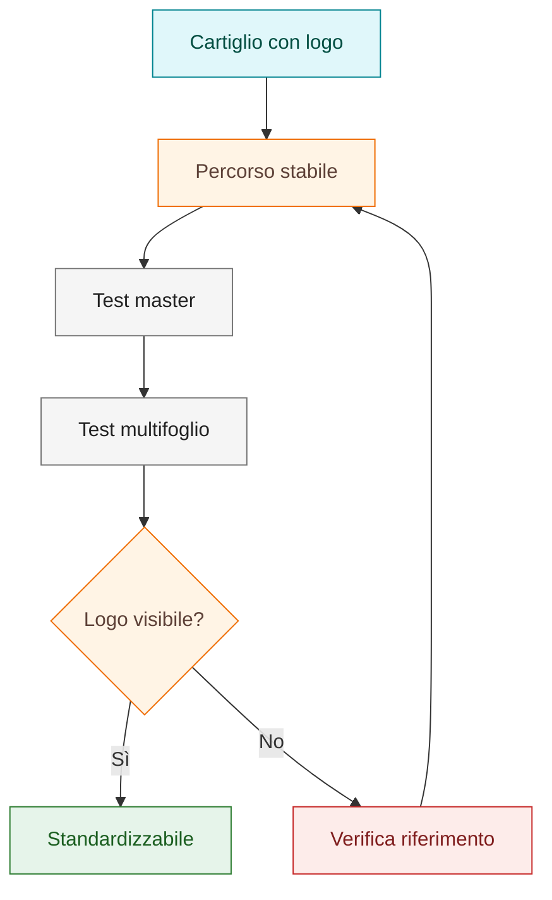

# Playbook — Gestire cartiglio e logo

## Obiettivo

Gestire loghi e immagini nei cartigli riducendo problemi di riferimenti mancanti o non caricati.

## Quando usarlo

Usare questo playbook quando:

- un logo non viene visualizzato;
- nel multifoglio compare un riquadro al posto dell'immagine;
- una pagina standard deve essere riutilizzata;
- un cartiglio master contiene immagini collegate.

## Flusso operativo

## Procedura

### 1. Usare asset controllati

- Mantenere il logo in una posizione stabile.
- Evitare riferimenti casuali o temporanei.
- Non dipendere da file locali non documentati.

### 2. Testare il cartiglio master

- Aprire il file master.
- Verificare che il logo sia visibile.
- Salvare.
- Chiudere e riaprire.

### 3. Testare nel multifoglio

- Applicare il cartiglio a un progetto prova.
- Verificare la visibilità del logo.
- Controllare eventuali riquadri o riferimenti non risolti.

### 4. Risolvere riferimenti non caricati

Se compare un riquadro al posto dell'immagine:

- controllare il nome del file;
- controllare il riferimento;
- ricaricare l'immagine;
- ripetere il test dopo riapertura.

## Verifica finale

Il cartiglio è stabile quando:

- il logo è visibile nel master;
- il logo è visibile nel multifoglio;
- la visibilità resta corretta dopo riapertura;
- la procedura è ripetibile.

## Collegamenti

- [Pagine, cartigli e immagini](../05-pages-titleblocks-images.md)
- [Troubleshooting](../07-troubleshooting.md)
